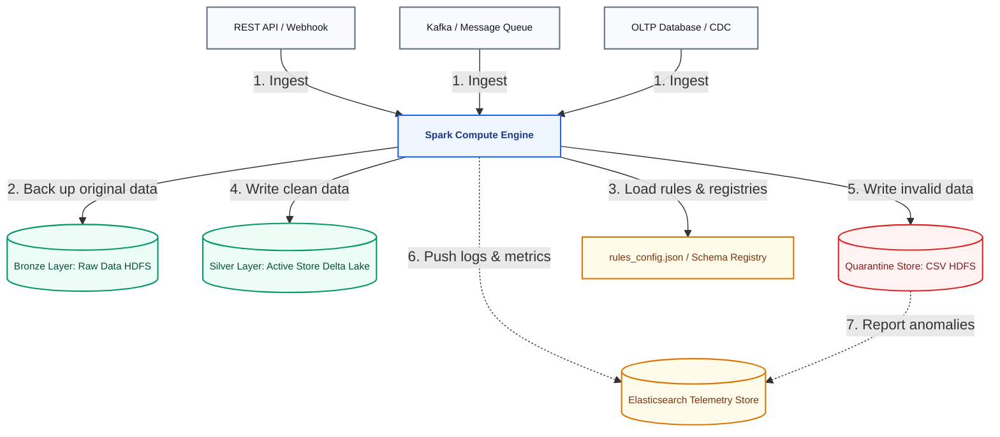
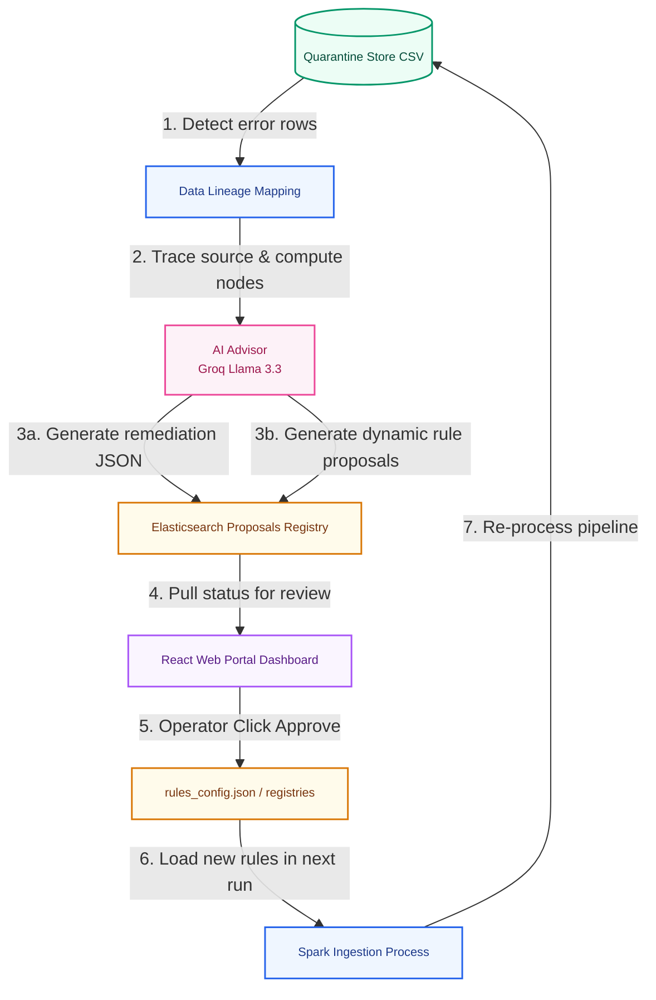
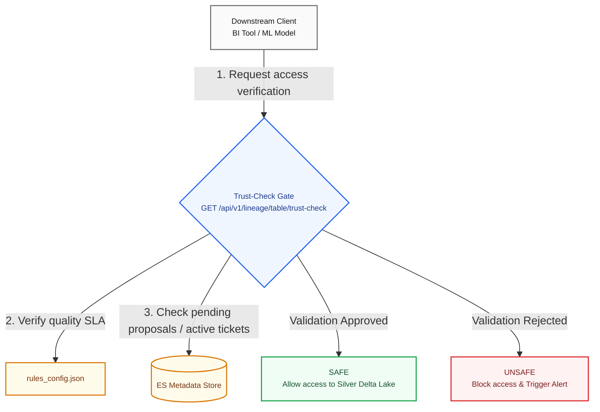

# เอกสารการออกแบบกระบวนการจัดการข้อมูล (Data Management Process Design)
## โครงการ SDOQAP (Scalable Data Observability and Quality Assurance Platform)
**บทบาท:** Data Architect

---

## 1. บทนำและวัตถุประสงค์ (Introduction & Objectives)

แพลตฟอร์ม SDOQAP ออกแบบขึ้นเพื่อเป็นระบบการบริหารจัดการข้อมูลเชิงรุก (Proactive Data Management) ที่รองรับแหล่งข้อมูลหลากหลายรูปแบบ เช่น CSV, REST API, Streaming และ RDBMS โดยมีเป้าหมายหลักในการตรวจสอบ สแกน ตรวจจับ และส่งสัญญาณป้อนกลับเพื่อแก้ไขข้อผิดพลาดที่ต้นน้ำ (Upstream Source) เพื่อรับประกันความน่าเชื่อถือของข้อมูล (Data Trustworthiness) ก่อนนำไปใช้ในระบบวิเคราะห์และประมวลผลปลายน้ำ (Downstream Systems)

---

## 2. หลักการออกแบบระบบ (System Design Principles)

ระบบ SDOQAP ได้รับการออกแบบตามหลักเกณฑ์การพัฒนาซอฟต์แวร์และการจัดการข้อมูลดังนี้:

1.  **Upstream Remediation First:**
    *   การกักเก็บข้อมูลใน Quarantine Store เป็นเพียงมาตรการชั่วคราวเพื่อป้องกันผลกระทบต่อระบบประมวลผลหลักและรักษาความต่อเนื่องทางธุรกิจ (Business Resilience)
    *   เป้าหมายหลักคือการสืบหาต้นตอเพื่อปิดช่องโหว่ความผิดพลาดของข้อมูลที่ Upstream (เช่น API Error, Database Schema Migration หรือ Schema Drift)
2.  **End-to-End Observability:**
    *   Data Lineage คือกุญแจสำคัญในการวินิจฉัยหาสาเหตุของปัญหา (Root Cause Diagnosis) ระบบ Observability ต้องแสดงทิศทางการไหลของข้อมูลตั้งแต่ขั้นตอน Ingestion จนถึง Serving ได้อย่างสมบูรณ์

---

## 3. สถาปัตยกรรมข้อมูลและการแบ่งระดับพื้นที่จัดเก็บ (Data Architecture & Storage Tiering)

แผนผังแสดงโครงสร้างการจัดเก็บข้อมูลและการเชื่อมโยงข้อมูลในระบบ (สไตล์ Draw.io Block Diagram):

*   **1. Bronze Layer (HDFS Raw Zone):** จัดเก็บข้อมูลในรูปแบบเดิมที่ได้รับมาโดยไม่มีการแก้ไขโครงสร้าง เพื่อใช้เป็นประวัติอ้างอิงและประมวลผลย้อนหลัง (Reprocessing)
*   **2. Silver Layer: Active Store (Delta Lake):** จัดเก็บข้อมูลที่ถูกต้อง (Clean Rows) รองรับคุณสมบัติ ACID Transactions สำหรับระบบ BI และ Machine Learning
*   **3. Silver Layer: Quarantine Store (HDFS CSV):** แยกเก็บแถวข้อมูลที่ไม่ผ่านเกณฑ์คุณภาพพร้อมคอลัมน์ `reject_reason` และ `run_id` สำหรับวิเคราะห์รูปแบบข้อผิดพลาด
*   **4. Observability & Metadata Layer (Elasticsearch):** จัดเก็บข้อมูลสถิติ (Data Profiling), ประวัติการประมวลผล (Pipeline Runs), แผนภาพความเชื่อมโยง (Data Lineage) และตั๋วแก้ไขข้อผิดพลาด (Remediation Tickets)

---

## 4. กระบวนการนำเข้าข้อมูลและการตรวจสอบคุณภาพ (Data Ingestion & Validation Pipeline)

แผนผังแสดงขั้นตอนการประมวลผลข้อมูลตั้งแต่รับเข้าจนถึงการแยกบันทึกข้อมูล (สไตล์ Draw.io Pipeline Diagram):

```mermaid
graph LR
    classDef start_node fill:#f8fafc,stroke:#64748b,stroke-width:1.5px,color:#0f172a,font-size:11px;
    classDef gate fill:#fdf4ff,stroke:#d946ef,stroke-width:1.5px,color:#701a75,font-size:11px;
    classDef validation fill:#eff6ff,stroke:#2563eb,stroke-width:1.5px,color:#1e3a8a,font-size:11px;
    classDef clean_out fill:#ecfdf5,stroke:#059669,stroke-width:1.5px,color:#064e3b,font-size:11px;
    classDef error_out fill:#fef2f2,stroke:#dc2626,stroke-width:1.5px,color:#7f1d1d,font-size:11px;

    %% Nodes
    Source[Raw Data Ingestion]:::start_node
    Drift_Gate{Schema Drift Gate<br>Calculate Severity}:::gate
    
    Auto_Evolve[Auto-Evolve Registry<br>Update Config]:::gate
    Type_Cast[Cast String<br>Block Auto-Update]:::gate
    
    Layer1[Layer 1 Check: Null Key / Duplicates]:::validation
    Layer2[Layer 2 Check: Adaptive Stats / IQR]:::validation
    Layer3[Layer 3 Check: Groq AI Semantic Check]:::validation
    
    Active_Store[(Active Store<br>Delta Lake)]:::clean_out
    Quarantine_Store[(Quarantine Store<br>CSV)]:::error_out

    %% Flow
    Source --> Drift_Gate
    Drift_Gate -->|Severity Score <= 4| Auto_Evolve
    Drift_Gate -->|Severity Score > 4| Type_Cast
    
    Auto_Evolve & Type_Cast --> Layer1
    Layer1 --> Layer2
    Layer2 --> Layer3
    
    Layer3 -->|Data is Valid| Active_Store
    Layer3 -->|Data is Invalid| Quarantine_Store
```

1.  **Schema Evolution Gate:** ตรวจสอบโครงสร้างข้อมูลเปรียบเทียบกับ `schema_registry.json`
    *   **Safe Drift (Score <= 4):** อัปเดตโครงสร้างข้อมูลอ้างอิงโดยอัตโนมัติ (Auto-Evolve)
    *   **Dangerous Drift (Score > 4):** บล็อกการอัปเดตสเปก, แปลงข้อมูลที่มีปัญหาให้เป็นประเภท String เพื่อป้องกันระบบหยุดชะงัก และส่งข้อเสนอรอตรวจ (Schema Proposal) ไปยัง Elasticsearch
2.  **3-Layer Quality Validation:**
    *   **Layer 1 (Static Rules):** ตรวจสอบคีย์หลักว่างเปล่า หรือข้อมูลซ้ำซ้อน
    *   **Layer 2 (Dynamic Rules):** ปรับเกณฑ์ยอมรับตามแนวโน้มสถิติย้อนหลัง (Adaptive) และตรวจสอบช่วงขอบเขต IQR (Auto IQR)
    *   **Layer 3 (AI Rules):** ตรวจสอบความสอดคล้องเชิงความหมายด้วยโมเดล Groq Llama 3.3
3.  **Segregation Routing:** แยกบันทึกข้อมูลดีลง Active Store (Delta Lake Merge) และข้อมูลเสียลง Quarantine Store (CSV)

---

## 5. กระบวนการสืบค้นและปรับเปลี่ยนกฎเกณฑ์แบบวงจรปิด (Remediation & Closed-loop Rule Update)

แผนผังแสดงวงจรตรวจจับ วิเคราะห์ด้วย AI และอัปเดตกฎความปลอดภัย (สไตล์ Draw.io Closed-loop Diagram):

*   **1. การสืบค้นต้นเหตุ (Data Lineage Trace):** เมื่อข้อมูลถูกส่งเข้า Quarantine Store ระบบจะทำแผนผัง Data Lineage เพื่อชี้เป้าว่าข้อผิดพลาดมาจาก API, Database Migration หรือตัวดึงข้อมูลเอง
*   **2. การวิเคราะห์ด้วย AI Advisor:** AI จะอ่านตัวอย่างข้อมูลที่มีปัญหาและประวัติสถิติ เพื่อระบุสาเหตุแบบเข้าใจง่าย และสร้าง **Remediation Ticket** รูปแบบ JSON ส่งไปแจ้งเตือนทีมพัฒนาต้นทางผ่าน Slack/Jira
*   **3. การปรับแต่งกฎข้อจำกัดพลวัต (Dynamic Rule Proposal):** AI เสนออัปเดตเกณฑ์ทางคณิตศาสตร์ใน `rules_config.json` ให้อยู่ในสเตตัส `PROPOSED`
*   **4. ระบบอนุมัติและการอัปเดตระบบ:** วิศวกรข้อมูลทบทวนและกดอนุมัติบน Web Portal ซึ่งจะอัปเดตไฟล์คอนฟิกทันที ทำให้การทำงานในรอบถัดไปประยุกต์ใช้เกณฑ์ใหม่ได้ทันที

---

## 6. การตรวจสอบสิทธิ์การดึงข้อมูลปลายน้ำ (Data Serving & Trust-Check Gate)

แผนผังการดักกรองระบบปลายน้ำก่อนดึงข้อมูลใน Delta Lake ไปใช้งาน (สไตล์ Draw.io API Gate Diagram):

*   **Trust-Check Specification:** ระบบภายนอกจะเรียก API เส้น `/trust-check` ก่อนเข้าใช้ข้อมูล โดยระบบจะประเมินคะแนนคุณภาพขั้นต่ำ (SLA), จำนวนตั๋วข้อผิดพลาดค้างประเมิน และความสดใหม่ของข้อมูล
*   **SAFE:** อนุญาตให้ดึงข้อมูลจาก Silver Delta Lake ได้ตามปกติ
*   **UNSAFE:** บล็อกการดึงข้อมูลเพื่อปกป้องแบบจำลองการวิเคราะห์ (Analytics Models) ปลายน้ำไม่ให้ประมวลผลผิดพลาด

---

## 7. ตารางสรุปหน้าที่ความรับผิดชอบในกระบวนการจัดการข้อมูล (System Roles & Responsibilities)

| ผู้รับผิดชอบ | หน้าที่การทำงาน |
| :--- | :--- |
| **Upstream Data Owners** | • ดูแลและปรับปรุงโครงสร้างข้อมูลหลัก และแจ้งล่วงหน้าหากมี Database Migration หรือ API Changes • จัดให้มีกลไกตรวจสอบความถูกต้องเบื้องต้นก่อนส่งข้อมูลเข้าท่อส่ง |
| **Spark Engine** | • ทำหน้าที่สแกนตรวจจับ Schema Drift และตรวจสอบคุณภาพข้อมูลแบบ Row-level • จัดการคัดแยกข้อมูลส่งเข้า Active Store หรือ Quarantine Store |
| **AI Advisor** | • วิเคราะห์ตรวจจับรูปแบบข้อผิดพลาด (Error Patterns) จากตัวอย่างแถวข้อมูลที่ผิดปกติผ่าน Groq Llama 3.3 • นำเสนอแผนปรับปรุงสเปกข้อมูลและตั๋วระบุแนวทางการแก้ไขที่ระบบต้นทาง |
| **Data Engineers** | • ตรวจสอบและพิจารณาอนุมัติข้อเสนอที่ค้างอยู่ (Proposals & Tickets) ผ่าน Web Portal เพื่ออัปเดตไฟล์คอนฟิกหลัก • ติดตามตรวจสอบแผนภูมิ Data Lineage เพื่อแก้ไขปัญหาระยะยาว |
| **Downstream Consumers** | • ตรวจเช็คสถานะความปลอดภัยข้อมูลผ่าน Trust-Check API ก่อนเข้าถึงข้อมูลจริงใน Delta Lake |

---
**เอกสารการออกแบบนี้ได้รับการจัดทำและทบทวนตามหลักสถาปัตยกรรม Upstream-First Remediation เพื่อระบบข้อมูลที่มั่นคงและยั่งยืน**
