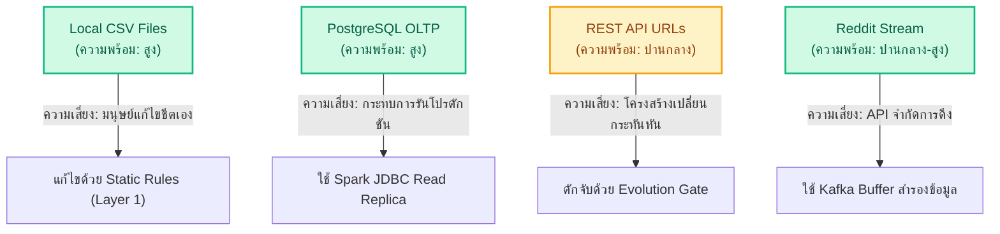

# รายงานการสำรวจความต้องการและประเมินความพร้อมใช้ของข้อมูล (Data Requirements & Readiness Assessment Report)
## โครงการ SDOQAP (Scalable Data Observability and Quality Assurance Platform)

เอกสารฉบับนี้จัดทำขึ้นเพื่อรายงานผลการสำรวจ วิเคราะห์ และประเมินความพร้อมในการใช้ข้อมูลจากแหล่งข้อมูลต้นทางต่าง ๆ ที่ไหลเข้าสู่แพลตฟอร์ม SDOQAP ตามมาตรฐานการประมวลผลข้อมูลขนาดใหญ่และหลักการธรรมาภิบาลข้อมูล (Data Governance)

---

## 1. การสำรวจความต้องการข้อมูลและสภาพแวดล้อมของแหล่งข้อมูล (Data Requirements & Ingestion Environment)

ระบบ SDOQAP ถูกออกแบบมาให้รองรับสภาพแวดล้อมของแหล่งข้อมูลต้นทาง (Source Environments) ที่มีโครงสร้างและพฤติกรรมแตกต่างกัน 4 ช่องทางหลัก ดังนี้:

| ช่องทางนำเข้าข้อมูล | สภาพแวดล้อม (Environment) | รูปแบบข้อมูล (Format) | ความต้องการระบบ (System Requirements) |
| :--- | :--- | :--- | :--- |
| **1. Local CSV Files** | Local Directory / Network Share | Structured CSV | • เข้ารหัสแบบ UTF-8 • มีโครงสร้างหัวคอลัมน์คงที่ • ไม่มีบรรทัดชำรุด (Malformed lines) |
| **2. REST API Endpoints** | Web Server / HTTP/HTTPS URLs | Semi-Structured JSON | • สิทธิ์การเข้าถึง API Token • กลไกแปลง JSON Array เป็น Flat CSV • การควบคุม Network Timeout และ Rate Limit |
| **3. Reddit Streamer** | Reddit API / PRAW Client | Streaming JSON (Text + Metadata) | • Reddit API Credentials • Zookeeper & Kafka Cluster Broker • Spark Structured Streaming (Real-time) |
| **4. PostgreSQL OLTP** | Relational Database Cluster | RDBMS Relational Tables | • JDBC Drivers บน Spark Container • สิทธิ์ Read-Only (Read replica) ป้องกันล็อกตารางหลัก |

---

## 2. จำนวนแหล่งข้อมูลและปริมาณข้อมูล (Number of Data Sources & Data Volume)

จากการตรวจสอบระบบ คลังข้อมูลที่ใช้ในการประมวลผลและทดสอบสามารถแบ่งกลุ่มตามขนาดและปริมาณข้อมูลออกเป็น 3 ระดับ (Tiering):

### 2.1 จำนวนแหล่งข้อมูล (Core Datasets)
ระบบมี **11 ชุดข้อมูลหลัก** ที่รันผ่านท่อทดสอบคุณภาพ (Benchmark Test Suite):
1.  `bank_data` / `bank_data_csv` (ข้อมูลธุรกรรมการเงินและประวัติธนาคาร)
2.  `chumphon_budget` / `choumpon_budget` (ข้อมูลสถิติงบประมาณจังหวัดชุมพร)
3.  `customers` (ข้อมูลประวัติลูกค้า)
4.  `gov_data` (ข้อมูลสถิติภาครัฐ)
5.  `inventory` (ข้อมูลสต็อกสินค้าคงคลัง)
6.  `orders` (ข้อมูลคำสั่งซื้อสินค้า E-Commerce)
7.  `products` (ข้อมูลสเปกสินค้า)
8.  `thai_housing_smart_test` (ข้อมูลวิเคราะห์ตลาดอสังหาริมทรัพย์ไทย)
9.  `users` (ข้อมูลโปรไฟล์และบัญชีผู้ใช้งาน)
10. `web_api_users_test` (ข้อมูลการเข้าใช้ระบบจาก API)
11. `Olist Brazilian E-Commerce` (ชุดข้อมูลขนาดใหญ่ ประกอบด้วย 9 ตารางย่อย เช่น Customers, Orders, Payments, Reviews)

### 2.2 ปริมาณข้อมูลสะสม (Data Volume Auditing)
*   **Tier 1: Small/Batch Test (ระดับทดสอบ):** ขนาดตั้งแต่ **ไม่กี่ร้อย Bytes ถึง 100 KB** (เช่น `users_dummy.csv`, `bank-data.csv` ขนาด 34KB) เหมาะสำหรับการรันตรวจสอบความถูกต้องของกฎ Static Rules อย่างรวดเร็ว
*   **Tier 2: Medium/Simulation (ระดับจำลอง):** ขนาดตั้งแต่ **1 MB ถึง 120 MB** (เช่น ข้อมูล Olist E-Commerce รวม 9 ตารางย่อย ขนาดประมาณ 120MB) ใช้ทดสอบ ETL Pipeline และการทำ Data Lineage Map
*   **Tier 3: Large/Stress-Test (ระดับทดสอบความเสถียร):**
    *   `100000 Sales Records.csv` ขนาด **12.4 MB** (ข้อมูลธุรกรรมแสนแถว)
    *   `mbti_clean.csv` ขนาด **739 MB** (ข้อมูลดิบขนาดใหญ่มาก) ใช้สำหรับ Benchmarking หาคอขวดระบบหน่วยความจำ (Out of Memory - OOM) ตามเกณฑ์ KPI-04

---

## 3. ผลการประเมินความพร้อมใช้งานของข้อมูล (Data Readiness Assessment Results)

ผลการประเมินวิเคราะห์จุดเด่น ข้อจำกัด และแนวทางรับมือความเสี่ยง (Mitigation Plan) เพื่อคัดกรองความพร้อมใช้ก่อนโปรโมตเข้าสู่ระบบวิเคราะห์ปลายน้ำ (Downstream Protection):

### 3.1 การประเมินรายแหล่งข้อมูล (Source-by-Source Readiness Evaluation)

#### 1. Local CSV Files
*   **สถานะความพร้อมใช้:** **HIGH (พร้อมใช้งานสูง)**
*   **ข้อจำกัด/ความเสี่ยง:** ข้อมูลมักเกิดจากมนุษย์บันทึกเอง (Manual Input) มีโอกาสพบค่าว่าง (Null), ค่าซ้ำ (Duplicate), หรือการสะกดผิดสูง
*   **มาตรการรับมือ:** การรันกฎตรวจสอบ Static Rules (Layer 1) เพื่อปัดตกแถวข้อมูลเสียเข้าสู่ Quarantine Store ก่อนบันทึกลง HDFS Active Store

#### 2. PostgreSQL OLTP Database
*   **สถานะความพร้อมใช้:** **HIGH (พร้อมใช้งานสูง)**
*   **ข้อจำกัด/ความเสี่ยง:** โครงสร้างข้อมูลมีความเสถียรเนื่องจากควบคุมด้วย RDBMS Schemas แต่หากใช้ Spark ยิง Query ตรง ๆ ในเวลาทำงานปกติ อาจส่งผลให้ระบบงานหลักสะดุด
*   **มาตรการรับมือ:** กำหนดให้อ่านข้อมูลผ่าน Read-Replica หรือทำ DB Mirroring และใช้ Spark Size-Based Partition Tuning เพื่อเฉลี่ยโหลดการดึงข้อมูล

#### 3. REST API Endpoints
*   **สถานะความพร้อมใช้:** **MEDIUM (พร้อมใช้งานปานกลาง)**
*   **ข้อจำกัด/ความเสี่ยง:** มีความผันผวนด้านเครือข่าย (Network Latency) และมีความเสี่ยงสูงต่อการเกิด **Schema Drift** (ผู้ให้บริการ API เปลี่ยนคีย์ JSON โดยไม่แจ้งล่วงหน้า)
*   **มาตรการรับมือ:** ติดตั้งด่าน Evolution Gate เพื่อคำนวณ Severity Score ทันทีที่ดึงข้อมูล หากพบ Dangerous Drift จะบล็อกและ Cast คอลัมน์เจ้าปัญหาเป็น String ทันทีเพื่อความปลอดภัย

#### 4. Reddit Live Streamer (Streaming Feed)
*   **สถานะความพร้อมใช้:** **MEDIUM-HIGH (พร้อมใช้งานปานกลางถึงสูง)**
*   **ข้อจำกัด/ความเสี่ยง:** ข้อมูลไหลเข้าตลอดเวลาด้วยความเร็วสูง มีความเสี่ยงต่อการเกิดข้อมูลสะสมค้างสะท้อน (Consumer Lag) หรือสิทธิ์โทเค็นดึงข้อมูลหมดอายุ
*   **มาตรการรับมือ:** ใช้ Kafka Message Broker เป็นตัวซับแรงกระแทก (Buffer) และประมวลผลด้วย Spark Structured Streaming ร่วมกับ n8n เพื่อยิงแจ้งเตือนผ่าน Slack ทันทีหากท่อหยุดไหล

---

## 4. สรุปคำแนะนำเชิงวิศวกรรมข้อมูล (Data Engineering Recommendations)

1.  **การควบคุมความปลอดภัยปลายน้ำ (Downstream Safety):** ก่อนที่ระบบวิเคราะห์เชิงธุรกิจ (BI/ML/Analytics) จะดึงข้อมูลไปใช้ ควรเรียกใช้งานบริการ **Trust-Check API** (`/api/v1/lineage/{table}/trust-check`) ของระบบ SDOQAP เพื่อตรวจสอบให้มั่นใจว่าตารางข้อมูลดังกล่าวมีระดับคะแนน Data Quality Score สูงกว่ามาตรฐานที่ตกลงไว้ (SLA) และไม่มีตั๋วค้างสถานะ Dangerous Drift
2.  **การตั้งรับการขยายตัว (Scale-up Strategy):** สำหรับชุดข้อมูลขนาดใหญ่ระดับ 700 MB+ (`mbti_clean.csv`) Spark Master ควรได้รับการกำหนดค่าหน่วยความจำคอนเทนเนอร์ไม่ต่ำกว่า 4GB และปรับเพิ่มพาร์ทิชันย่อย (`spark.sql.shuffle.partitions`) เป็น 20+ เพื่อป้องกันการแครชแบบ Out of Memory (OOM)
3.  **การปรับกฎเกณฑ์คุณภาพแบบปิดปูป (Closed-loop Rule Updates):** ควรสแกน Quarantine Store เป็นระยะ และอนุญาตให้ AI ทำการประเมินประวัติ Anomalies เพื่อเสนอปรับปรุงค่าความผิดปกติเชิงสถิติ (Dynamic Limits) ให้สอดรับกับความเปลี่ยนแปลงจริง
