# แผนภาพการคัดแยกข้อมูลเสีย (Data Segregation Flow)
## โครงการ SDOQAP (Scalable Data Observability and Quality Assurance Platform)

เอกสารนี้รวบรวมแผนผังย่อยสำหรับ **สไลด์นำเสนอแผ่นที่ 2: แผนภาพการคัดแยกข้อมูลเสีย (Data Segregation Flow)** โดยเฉพาะ เพื่อแสดงทิศทางการไหลของข้อมูลดิบเมื่อเผชิญกับระดับ Schema Drift และวิธีการคัดแยกข้อมูลดี (Clean Rows) และข้อมูลชำรุด (Damaged Rows) ออกเป็นระบบแยกเก็บต่างหาก (Active vs Quarantine) พร้อมขยายฟอนต์ใหญ่พิเศษ (**font-size: 26px, ตัวหนา**) สำหรับการนำเสนอ

---

## 1. แผนผังการคัดแยกข้อมูลสำหรับสไลด์แผ่นที่ 2 (Slide 2 Mermaid Flowchart)

```mermaid
graph LR
    %% ==========================================
    %% CLASS DEFINITIONS (Enforced Large Font Size for Slides)
    %% ==========================================
    classDef source fill:#333333,stroke:#666666,stroke-width:2.5px,rx:5px,ry:5px,color:#ffffff,font-size:26px,font-weight:bold;
    classDef bronze fill:#1e293b,stroke:#3b82f6,stroke-width:2.5px,rx:5px,ry:5px,color:#ffffff,font-size:26px,font-weight:bold;
    classDef silver fill:#064e3b,stroke:#10b981,stroke-width:2.5px,rx:5px,ry:5px,color:#ffffff,font-size:26px,font-weight:bold;
    classDef gold fill:#78350f,stroke:#f59e0b,stroke-width:2.5px,rx:5px,ry:5px,color:#ffffff,font-size:26px,font-weight:bold;
    classDef engine fill:#4c1d95,stroke:#8b5cf6,stroke-width:2.5px,rx:5px,ry:5px,color:#ffffff,font-size:26px,font-weight:bold;
    classDef ui fill:#831843,stroke:#ec4899,stroke-width:2.5px,rx:5px,ry:5px,color:#ffffff,font-size:26px,font-weight:bold;
    classDef block fill:#7f1d1d,stroke:#ef4444,stroke-width:2.5px,rx:5px,ry:5px,color:#ffffff,font-size:26px,font-weight:bold;
    classDef ai fill:#7c2d12,stroke:#f97316,stroke-width:3px,rx:5px,ry:5px,color:#ffffff,font-size:26px,font-weight:bold;

    %% ==========================================
    %% DATA SEGREGATION FLOW NODES
    %% ==========================================
    Ingested_Data["Spark Ingestion Stream"]:::source
    
    Drift_Check{"Schema Drift?"}:::engine
    Block_Cast["Block Spec & Cast String"]:::block
    Auto_Evolve["Auto-Evolve Schema"]:::silver
    
    Validation_Check["3-Layer Quality Validation"]:::engine
    
    Active_Store["Active Store (Silver Delta)"]:::silver
    Quarantine_Store["Quarantine Store (Silver CSV)"]:::block
    
    ES_Logs[("ES Quality Runs")]:::gold
    AI_Generator["AI Rules Generator"]:::ai

    %% ==========================================
    %% FLOW CONNECTIONS
    %% ==========================================
    
    %% Ingest to Drift Check
    Ingested_Data --> Drift_Check
    
    %% Schema Evolution Gate
    Drift_Check -->|Dangerous Drift| Block_Cast
    Drift_Check -->|Safe Drift| Auto_Evolve
    
    %% Flow to Quality Check
    Block_Cast --> Validation_Check
    Auto_Evolve --> Validation_Check
    
    %% Segregation Routing (Clean vs Damaged)
    Validation_Check -->|Clean Rows| Active_Store
    Validation_Check -->|Damaged Rows| Quarantine_Store
    
    %% Telemetry & Feedback
    Active_Store -.->|Log Stats| ES_Logs
    Quarantine_Store -.->|Log Stats| ES_Logs
    Quarantine_Store -->|Analyze Anomaly| AI_Generator
    AI_Generator -.->|Feedback: Update Rules| Validation_Check
```

---

## 2. อธิบายขั้นตอนการทำงาน (Data Segregation Workflow)

1. **Spark Ingestion Stream:** รับสตรีมหรือไฟล์ข้อมูลดิบจาก Bronze Layer เข้าสู่หน่วยประมวลผล
2. **Schema Drift Gate:** ตรวจสอบว่าหัวตารางตรงตามไฟล์จดทะเบียนหรือไม่
   * **Dangerous Drift:** หากโครงสร้างเปลี่ยนไปอย่างเป็นอันตราย (คอลัมน์หาย) ➔ ระบบจะแปลงข้อมูลช่องดังกล่าวให้เป็นสายอักขระ (`Cast String`) เพื่อความคงทน และบล็อกไม่ให้เกิดการแก้ไข Registry
   * **Safe Drift:** หากพบคอลัมน์ใหม่เพิ่มเข้ามาอย่างปลอดภัย ➔ ระบบจะอัปเดตสเปกโครงสร้างอัตโนมัติ (`Auto-Evolve`)
3. **3-Layer Quality Validation:** ประเมินคุณภาพข้อมูลระดับแถวผ่านกฎ 3 เลเยอร์ (Static, Dynamic, และ AI Rules)
4. **Data Segregation Routing (การแยกพื้นที่จัดเก็บ):**
   * **Clean Rows:** แถวข้อมูลที่ถูกต้องทั้งหมดจะผ่านการทำ Delta Lake Merge (Upsert) เพื่อบันทึกลงใน **Active Store (Silver Delta)**
   * **Damaged Rows:** แถวข้อมูลเสีย (ตกเกณฑ์ข้อห้าม, ค่าว่าง, ค่าผิดปกติสถิติ) จะถูกดีดส่งไปจัดเก็บลงใน **Quarantine Store (Silver CSV)** โดยไม่ทำให้ระบบล่ม
5. **Observability & Closed-Loop Loop:**
   * สถิติการจัดเก็บบันทึกลงใน **Elasticsearch**
   * ข้อมูลเสียหายในเขตกักกัน (Quarantine Store) จะถูกดึงไปให้ **AI Rules Generator** วิเคราะห์เพื่อออกกฎเกณฑ์ Dynamic Rules ชุดใหม่ป้อนกลับมาอัปเดตขีดจำกัดคุณภาพให้ยืดหยุ่นขึ้นโดยอัตโนมัติ
