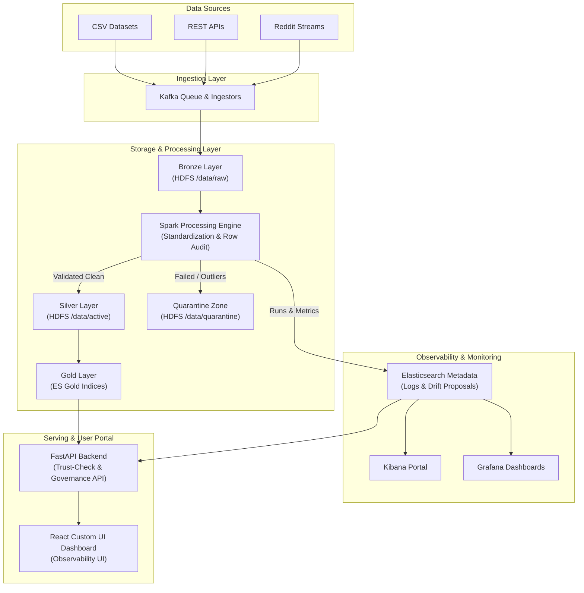

# เอกสารข้อกำหนดขอบเขตงาน (Terms of Reference - TOR)
## โครงการระบบบริหารจัดการความน่าเชื่อถือและติดตามเส้นทางข้อมูลขนาดใหญ่
### (Scalable Data Observability and Quality Assurance Platform - SDOQAP)

---

## 1. หลักการและเหตุผล (Background)
ในปัจจุบันการดำเนินธุรกิจขององค์กรถูกขับเคลื่อนด้วยข้อมูลขนาดใหญ่ (Big Data) ที่ถูกรวบรวมมาจากแหล่งข้อมูลที่หลากหลายและมีรูปแบบที่แตกต่างกัน เช่น ระบบฐานข้อมูลหลัก (OLTP Database), REST API จากภายนอก, และไฟล์ข้อมูลดิบ (CSV/JSON/Excel) 

ปัญหาสำคัญที่เกิดขึ้นอยู่เสมอคือ **ความน่าเชื่อถือของข้อมูล (Data Reliability)** และ **ความสามารถในการสังเกตการณ์ความเป็นมาของข้อมูล (Data Observability)** เมื่อเกิดปัญหาขึ้น เช่น โครงสร้างข้อมูลเปลี่ยนแปลงโดยไม่แจ้งล่วงหน้า (Schema Drift), ข้อมูลสูญหายระหว่างทาง (Data Ingestion Dropping), หรือข้อมูลซ้ำซ้อนและไม่ได้คุณภาพ สิ่งเหล่านี้จะส่งผลกระทบโดยตรงต่อระบบประมวลผลปลายน้ำ (Downstream Systems) รวมถึงแดชบอร์ดสรุปผลการบริหารและการตัดสินใจทางธุรกิจ

โครงการนี้จึงมุ่งพัฒนา **SDOQAP (Scalable Data Observability and Quality Assurance Platform)** ซึ่งเป็นระบบโครงสร้างพื้นฐานระดับโปรดักชัน (Production-grade Infrastructure) เพื่อทำหน้าที่รับข้อมูล ประมวลผลแบบกระจายศูนย์ ตรวจสอบคุณภาพข้อมูลในระดับแถว (Row-level Quality Validation) และสร้างระบบติดตามเส้นทางข้อมูลตั้งแต่ต้นน้ำจนถึงปลายน้ำ (End-to-End Data Lineage) โดยใช้สถาปัตยกรรมข้อมูลที่รองรับการขยายตัว (Scalable Architecture) เพื่อแก้ปัญหาคุณภาพข้อมูลอย่างยั่งยืน

---

## 2. วัตถุประสงค์ (Objectives)
1. **ออกแบบและพัฒนาระบบสถาปัตยกรรมข้อมูลขนาดใหญ่ (Big Data Architecture)** ที่รองรับการประมวลผลข้อมูลระดับล้านเรคคอร์ดได้อย่างมีประสิทธิภาพและเสถียรภาพ
2. **สร้างท่อส่งข้อมูล (Data Pipeline) พร้อมระบบตรวจสอบคุณภาพอัตโนมัติ (Automated Data Quality Engine)** ที่ประเมินผลและแจ้งเตือนคะแนนความบริสุทธิ์ของข้อมูลได้ทันที
3. **พัฒนาระบบ Data Observability** ที่ติดตาม ตรวจสอบ และแสดงแผนผังเส้นทางข้อมูล (Data Lineage Map) แบบเรียลไทม์ ตลอดจนประวัติการเปลี่ยนแปลงโครงสร้างข้อมูล (Schema Evolution)
4. **พัฒนาระบบกักกันข้อมูลชำรุดและกลไกกู้คืนระบบ (Quarantine & Autonomous Recovery)** เพื่อให้ท่อส่งข้อมูลหลักทำงานต่อได้อย่างสมบูรณ์ (Resilient Data Pipeline)
5. **สร้างระบบประมวลผลชั้นข้อมูลสรุป (Gold Layer Aggregation)** เพื่อลดภาระการประมวลผลซ้ำในการวิเคราะห์เชิงธุรกิจและหน้าแผงควบคุมแอปพลิเคชัน

---

## 3. ขอบเขตของโครงการ (Scope of Work)
โครงการพัฒนาระบบนี้มีระยะเวลาดำเนินการทั้งสิ้น 3 เดือน (12 สัปดาห์) โดยมีขอบเขตการทำงานแบ่งออกเป็น 6 ส่วนหลัก ดังนี้:

### 3.1 การรับและจัดเก็บข้อมูล (Data Ingestion & Storage Lake)
- พัฒนาระบบดึงข้อมูลจากแหล่งภายนอกแบบ Micro-batch และ Streaming (รองรับฐานข้อมูล OLTP, REST API, และไฟล์สเปรดชีต)
- จัดตั้งระบบคลังข้อมูลดิบ (Data Lake Storage) บน Apache Hadoop HDFS แบ่งออกเป็น 2 โซนหลักตามสถาปัตยกรรม Medallion:
  - **Active Store (`/data/active`)**: สำหรับเก็บข้อมูลสะอาดที่ผ่านเกณฑ์คุณภาพและได้รับการยืนยันแล้ว
  - **Quarantine Store (`/data/quarantine`)**: แยกข้อมูลดิบที่ตกเกณฑ์มาตรฐานออกไปกักกัน เพื่อรักษาความสมบูรณ์และปกป้องท่อน้ำดีหลัก

### 3.2 การประมวลผลและตรวจสอบคุณภาพ (Distributed Data Processing & Quality Engine)
- พัฒนาสคริปต์ประมวลผลข้อมูลขนานด้วย Apache Spark เพื่อทำ ETL ข้อมูลขนาดใหญ่
- ตรวจสอบกฎเกณฑ์ข้อมูล (Data Validation Rules) เช่น ค่าว่าง (Null), ค่าซ้ำ (Duplicate), รูปแบบไม่ตรงตามข้อกำหนด (Pattern Mismatch), และการเปลี่ยนแปลงโครงสร้าง (Schema Drift)
- พัฒนาระบบพยากรณ์แนวโน้มคุณภาพข้อมูลล่วงหน้า 7 วัน (7-Day Quality Score Projection) โดยใช้แบบจำลองถดถอยเชิงเส้น (Linear Regression) ร่วมกับสูตร Standard Error เพื่อหาช่วงความเชื่อมั่น (Confidence Interval - CI High/Low) และวิเคราะห์ความเสี่ยงการเกิด SLA Breach
- พัฒนาระบบจำแนกประเภทและจัดกลุ่มข้อบกพร่องของข้อมูล (Root Cause Error Pattern Clustering) ด้วย Quarantine Frequency Mapping Algorithm เพื่อระบุจุดคอขวดของแหล่งข้อมูลต้นทาง

### 3.3 ระบบการติดตามเส้นทางและสเปกข้อมูล (Data Observability & Lineage Visualization)
- จัดเก็บข้อมูลความสัมพันธ์ของท่อข้อมูล (Metadata Trace) และสถานะการประมวลผลลงใน Elasticsearch
- พัฒนาส่วนแสดงผลเส้นทางข้อมูล (End-to-End Real-time Data Lineage Map) บนแดชบอร์ดหลักของระบบ โดยแผนภาพจะต้องซิงก์โดยอัตโนมัติ (Auto-sync)
- แสดงเส้นเชื่อมโยง (Forks & Connectors) อย่างแม่นยำ พร้อมไฮไลต์สถานะด้วยสีแดงเด่นชัดเมื่อเกิดคอขวดหรือมีข้อมูลเสียไหลเข้าสู่ Quarantine Store

### 3.4 ระบบกักกันและการกู้คืนข้อมูล (Quarantine & Recovery)
- คัดแยกข้อมูลที่มีปัญหา (Data Quarantine) เพื่อป้องกันไม่ให้ท่อส่งข้อมูลหลักล่มหรือทำงานหยุดชะงัก
- พัฒนาระบบ Retry Ingestion & Audit เพื่อให้วิศวกรข้อมูลสามารถสั่งทำงานใหม่ (Pipeline Retry Engine) หลังจากปรับปรุงโครงสร้างข้อมูลหรือแก้ไขปัญหาระบบต้นน้ำแล้ว

### 3.5 ชั้นข้อมูลสรุปพร้อมใช้เชิงธุรกิจ (Gold Layer Aggregation)
- พัฒนา Gold Layer Aggregation Engine เพื่อนำข้อมูลจากชั้น Silver (HDFS Active Store) มาประมวลผลสรุป (Pre-aggregate) และเก็บลงใน Elasticsearch Gold Indices ทั้ง 4 ชุด:
  - `sdoqap_gold_daily_quality` (คะแนนคุณภาพสรุปรายวันรายตาราง)
  - `sdoqap_gold_error_patterns` (สัดส่วนและประเภทของ Error ที่พบบ่อย)
  - `sdoqap_gold_financial_impact` (มูลค่าความเสียหายสะสมเชิงธุรกิจ)
  - `sdoqap_gold_schema_drift` (ประวัติและปริมาณการเปลี่ยนแปลงโครงสร้างข้อมูล)
- รองรับการเรียกดูแบบด่วนเพื่อลดภาระการวิเคราะห์แบบเรียลไทม์ และรองรับการสั่ง Rebuild ข้อมูล Gold Layer ใหม่ผ่านทาง REST API

### 3.6 การให้บริการข้อมูลและแผงควบคุมหลัก (Serving API & Custom UI)
- พัฒนา FastAPI Backend ความเร็วสูง เพื่อให้บริการ REST API แก่ระบบภายนอกและการแสดงผลในหน้าจอหลัก
- พัฒนาแผงควบคุมผู้ใช้งาน (React Custom UI Dashboard) ที่ตอบสนองรวดเร็ว นำเสนอข้อมูลสถิติ KPI, แผนผัง Lineage แบบไดนามิก, สถิติวิเคราะห์ Anomaly, และระบบบริหารจัดการ Schema Governance อย่างเป็นระบบ

---

## 4. สถาปัตยกรรมระบบ (System Architecture)

ระบบประยุกต์ใช้แนวคิด **Medallion Architecture** ร่วมกับ **Data Observability** โดยมีผังการทำงานหลักดังนี้:

### รายละเอียด Technology Stack หลัก
- **Data Ingestion**: Python Ingestors, Kafka Queue
- **Distributed Storage**: Apache Hadoop HDFS & Delta Lake (สำหรับธุรกรรม ACID)
- **Processing Engine**: Apache Spark (Spark SQL, Delta Lake connector)
- **Metadata Database & Log Store**: Elasticsearch
- **Backend API**: FastAPI (Python 3.10+)
- **Frontend Portal**: React.js (Vite + Tailored CSS + Recharts)
- **Orchestration / Secondary Alerting**: n8n
- **Infrastructure System**: Docker / Docker Compose

---

## 5. คุณสมบัติทางเทคนิคของระบบ (System Requirements)

### 5.1 คุณสมบัติเชิงหน้าที่ (Functional Requirements)
- **FR-01 Automated Ingestion**: ระบบต้องรันดึงข้อมูลจาก Source หรือรับไฟล์ CSV/API โดยอัตโนมัติและจัดเก็บลง HDFS Raw Zone
- **FR-02 Parallel Processing**: ระบบต้องจัดสรรทรัพยากรบน Apache Spark เพื่อล้างข้อมูลและประเมินคุณภาพในระดับแถวแบบขนาน
- **FR-03 Multi-dimensional Quality**: ตรวจสอบกฎข้อมูลครอบคลุมความถูกต้อง (Validity), ความซ้ำซ้อน (Uniqueness), ความครบถ้วน (Completeness), ความสดใหม่ (Freshness) และ Schema Drift
- **FR-04 Live Lineage & Color Alert**: แสดงเส้นทางการไหลของท่อน้ำดีและท่อน้ำเสียบนแดชบอร์ด โดยมีเส้นเชื่อมโยงเปลี่ยนสีแดงเมื่อมีข้อมูลไหลเข้าสู่ Quarantine Zone
- **FR-05 Dynamic Outlier & Anomaly Detection**: ประยุกต์ใช้วิธี IQR สำหรับค่าสุดโต่ง, Z-score สำหรับค้นหาความผิดปกติของอัตราข้อมูลชำรุดสะสม, และตรรกะ Decision Tree ในการคัดกรองข้อมูลเสีย
- **FR-06 Pre-aggregated Gold Layer**: สรุปข้อมูลลง Elasticsearch Gold Indices เพื่อสนับสนุนการเข้าถึงข้อมูลของ BI Tools อย่างรวดเร็ว
- **FR-07 Schema Governance Gate**: สกัดกั้นการเขียนข้อมูลทับกรณีมี Schema Drift ขนาดใหญ่แบบอันตราย โดยสร้าง PENDING Schema Proposals เพื่อรอการอนุมัติผ่าน REST API ก่อน
- **FR-08 Downstream Protection (Trust-Check API)**: ให้บริการคำขอ GET ไปยัง `/api/v1/lineage/{table_name}/trust-check` เพื่อตรวจสอบความพร้อมและความปลอดภัยของข้อมูลก่อนที่ระบบ Analytics/BI จะดึงไปประมวลผลต่อ
- **FR-09 Concurrency Control & Atomic Commits**: นำ Distributed Lock มาใช้บน Elasticsearch เพื่อแก้ปัญหา Race Condition เมื่อมีการรันงานซ้ำซ้อน และใช้ Delta Lake ในการเขียนไฟล์ชั่วคราว (Staging) ก่อนทำการโปรโมตลง Active Zone ป้องกันข้อมูลค้างคาแบบครึ่งๆ กลางๆ (Zombified Data)

### 5.2 คุณสมบัติที่ไม่ใช่เชิงหน้าที่ (Non-Functional Requirements)
- **NFR-01 Performance & Scalability**: รองรับการประมวลผลข้อมูลดิบขนาดใหญ่และประมวลผลเสร็จสิ้นภายใน 10 นาที โดยระบบประมวลผลต้องปรับเปลี่ยนจำนวน Shuffle Partition ตามขนาดข้อมูลจริง (Fast Track vs Batch Track)
- **NFR-02 Resilient UI (Zero-Crash)**: หน้าจอแผงควบคุมต้องมีระบบแสดงผลแบบป้องกันตัว (Defensive Data Rendering) ป้องกันข้อผิดพลาดของระบบทำงานค้าง ขาว หรือขัดข้องเมื่อขาดข้อมูลบางส่วน
- **NFR-03 Clean & Compact UX/UI**: ผังภาพ Lineage และ UI แดชบอร์ดต้องกระชับ จัดการวางตำแหน่งการไหลไม่ให้ล้นขอบหรือทับซ้อนกันบนความละเอียดมาตรฐาน

---

## 6. แผนการดำเนินงานโครงการ 3 เดือน (Project Timeline)

| สัปดาห์ที่ | รายละเอียดงานที่ส่งมอบ / เป้าหมายหลัก |
| :---: | :--- |
| **W1-W2** | **ระบบจัดเก็บข้อมูลดิบและสถาปัตยกรรม (System Setup & Storage)** - ติดตั้ง Docker Infrastructure: HDFS Cluster, Elasticsearch, Kibana, Kafka - กำหนดสถาปัตยกรรมโฟลเดอร์ `/data/raw`, `/data/active`, `/data/quarantine` ใน HDFS |
| **W3-W4** | **ระบบดึงข้อมูลและเตรียมหน่วยประมวลผล (Ingestion & Spark Clusters)** - สร้าง Python API/CSV Ingestion module และระบบ Streaming Reddit ผ่าน Kafka - ตั้งค่าโครงสร้าง Apache Spark Node Clusters (Master & Workers) |
| **W5-W6** | **ตัวประมวลผลล้างและตรวจคุณภาพข้อมูล (Cleansing & Quality Engine)** - พัฒนา ETL Module บน Spark เพื่อจัดประเภทคอลัมน์มาตรฐาน - กำหนดกฎ Validation: เช็ค Null, เช็ค Duplicate, คอนฟิกค่าใน `schema_registry.json` |
| **W7-W8** | **ระบบตรวจวัด Schema Drift และพื้นที่กักเก็บ (Drift & Quarantine System)** - สร้างฟังก์ชันคำนวณ Z-score และ IQR บน `dynamic_rules_engine.py` - พัฒนาระบบสร้าง Schema Proposal และระบบสกัดข้อมูลเสียเข้า Quarantine Store บน HDFS |
| **W9-W10** | **ระบบบริการข้อมูลและจัดกลุ่มชั้นสรุป (Serving API & Gold Layer)** - พัฒนา FastAPI Server: สร้าง Endpoint สำหรับดึงประวัติ และจัดการ Proposal - พัฒนาสคริปต์ `spark_gold_layer.py` สรุปข้อมูลลง Gold indices รายวัน |
| **W11-W12** | **ส่วนต่อประสานผู้ใช้และการทดสอบรวม (React UI & Integration Testing)** - พัฒนา React Dashboard แสดงประวัติการทำงาน แผนภูมิ Lineage และผลการวิเคราะห์ COPDQ - รัน Integration test และ Stress test เพื่อจูนประสิทธิภาพหน่วยความจำระบบ (OOM Fix) |

---

## 7. ตัวชี้วัดความสำเร็จ (Key Performance Indicators: KPIs)
1. **Mean Time to Detection (MTTD) < 5 นาที**: ระบบต้องสแกน วิเคราะห์คุณภาพข้อมูล และส่งแจ้งเตือนกรณีพบโครงสร้างข้อมูลเบี่ยงเบน (Schema Drift) หรือคุณภาพตกต่ำกว่าเกณฑ์ภายใน 5 นาทีนับจากไฟล์เข้า HDFS
2. **Lineage Accuracy >= 95%**: ข้อมูลความสัมพันธ์ของท่อส่งต้องอัปเดตถูกต้อง สามารถสืบหาคอลัมน์หรือตารางต้นตอที่ส่งผลกระทบย้อนกลับได้สมบูรณ์
3. **Frontend Zero-Crash Rate**: เว็บแอปพลิเคชันไม่มีอาการค้างขาวหรือข้อผิดพลาดที่ไม่สามารถฟื้นตัวได้ในทุกสภาวะข้อมูลที่ส่งกลับจาก API
4. **Autonomous Ingestion Stability**: ระบบสามารถแยกข้อมูลชำรุดออกและส่งผ่านข้อมูลส่วนที่สะอาดไปใช้งานปลายน้ำได้อย่างราบรื่น 100% โดยที่กระบวนการประมวลผลรวมไม่หยุดทำงาน

---

## 8. กรอบการประเมินนวัตกรรมทางวิศวกรรมข้อมูล (Innovation & Maturity Assessment)

### 8.1 Medallion Architecture Standards
ระบบขยายขีดความสามารถมาตรฐานด้วยชั้น **Quarantine Zone** ซึ่งแยกออกจาก Silver Layer โดยสิ้นเชิง ทำให้กระบวนการล้างข้อมูลสามารถเก็บประวัติแถวข้อมูลที่มีปัญหาเอาไว้ทำการตรวจสอบย้อนหลัง (Auditing) โดยไม่ส่งผลกระทบให้ขั้นตอนทางธุรกิจใน Silver & Gold Layer หยุดชะงัก

### 8.2 Data Observability 5 เสาหลัก (Monte Carlo Framework)
- **Freshness**: มีระบบคำนวณระยะเวลาล่าช้าจากเวลาอัปเดตจริง (`max_lag_hours`) ทุกรอบการทำงาน
- **Volume**: ติดตามจำนวนเรคคอร์ดนำเข้าและจำนวนเรคคอร์ดชำรุดเพื่อดูสัดส่วนการสูญหายของข้อมูล
- **Schema**: เฝ้าระวัง Schema Drift ในระดับคอลัมน์และชนิดข้อมูล (Data Type Mismatch)
- **Lineage**: ติดตามการเชื่อมโยงของชุดข้อมูลตั้งแต่ไฟล์นำเข้าผ่าน API จนโปรโมตสู่ Silver Layer และ Gold Layer
- **Distribution**: มีกลไกวิเคราะห์ความกระจายตัวของคลาสข้อมูลเชิงลึก (Class Balance) และประเมินค่าผิดปกติผ่าน IQR/Z-Score

### 8.3 DataOps Principles
- **Automated Quality Gate**: ดักกรองและคัดแยกข้อมูลก่อนไหลเข้าคลังข้อมูลวิเคราะห์หลัก
- **Financial Accountability**: นำแนวคิด Cost of Poor Data Quality (COPDQ) มาคำนวณหาความสูญเสียสะสมทางการเงินที่เกิดจากข้อมูลไม่ได้คุณภาพจริงแบบเรียลไทม์
- **Upstream Governance**: เชื่อมโยงผลลัพธ์ข้อมูลสังเกตการณ์กลับไปยังผู้ดูแลระบบต้นทาง (Upstream Remediation) ป้องกันไม่ให้เกิดปัญหาซ้ำซาก เพื่อรักษาสมดุลและความเสถียรสูงสุดขององค์กร
