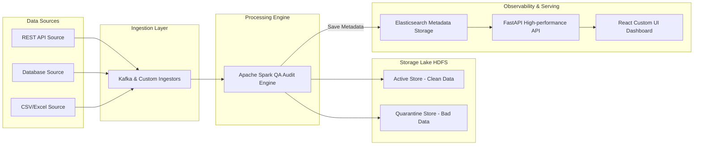

# เอกสารข้อกำหนดขอบเขตงาน (Terms of Reference: TOR) - Version 2.0 (ล่าสุด)
## โครงการระบบบริหารจัดการความน่าเชื่อถือและติดตามเส้นทางข้อมูลขนาดใหญ่
### (Scalable Data Observability and Quality Assurance Platform - SDOQAP)

---

## 1. หลักการและเหตุผล (Background)
ในปัจจุบัน องค์กรขับเคลื่อนด้วยข้อมูลขนาดใหญ่ (Big Data) ที่ถูกรวบรวมมาจากแหล่งข้อมูลที่หลากหลายและมีรูปแบบแตกต่างกัน เช่น ฐานข้อมูลเชิงสัมพันธ์, REST API, และไฟล์ข้อมูลดิบ (CSV/JSON/Excel) ปัญหาสำคัญที่มักเกิดขึ้นในกระบวนการจัดการข้อมูลคือความน่าเชื่อถือของข้อมูล (Data Reliability) และความสามารถในการสังเกตการณ์ความเป็นมาของข้อมูล (Data Observability)

ปรากฏการณ์ความผิดพลาดของข้อมูล อาทิ โครงสร้างข้อมูลเปลี่ยนแปลงโดยไม่แจ้งล่วงหน้า (Schema Drift), ข้อมูลสูญหายระหว่างท่อส่ง (Data Dropping), และข้อมูลซ้ำซ้อน ส่งผลกระทบโดยตรงต่อระบบประมวลผลปลายทาง รวมถึงโมเดลวิเคราะห์เชิงธุรกิจและแดชบอร์ดของผู้บริหาร โครงการนี้จึงมุ่งพัฒนาระบบกลางระดับโปรดักชัน (Production-grade Infrastructure) เพื่อทำหน้าที่รับข้อมูล ประมวลผลแบบกระจายศูนย์ ตรวจสอบคุณภาพข้อมูลในระดับแถว (Row-level Quality Validation) และสร้างระบบติดตามเส้นทางข้อมูลต้นน้ำถึงปลายน้ำ (End-to-End Data Lineage) โดยใช้สถาปัตยกรรมที่รองรับการสเกลข้อมูลปริมาณมากเพื่อแก้ปัญหาคอขวดอย่างยั่งยืน

---

## 2. วัตถุประสงค์ (Objectives)
1. **ออกแบบและพัฒนาระบบสถาปัตยกรรมข้อมูลขนาดใหญ่ (Big Data Architecture)** ที่รองรับการประมวลผลข้อมูลระดับล้านเรคคอร์ดได้อย่างมีประสิทธิภาพ
2. **สร้างท่อส่งข้อมูล (Data Pipeline)** ที่มีระบบตรวจสอบคุณภาพข้อมูลอัตโนมัติ (Automated Data Quality Engine) สามารถประเมินและแจ้งเตือนคะแนนความบริสุทธิ์ของข้อมูลได้ทันที
3. **พัฒนาระบบ Data Observability** ที่สามารถติดตาม ตรวจสอบ และแสดงผลเส้นทางข้อมูล (Data Lineage) แบบเรียลไทม์ และบันทึกประวัติการเปลี่ยนแปลงโครงสร้างข้อมูล
4. **พัฒนาระบบกักกันและกู้คืนข้อมูล (Quarantine and Autonomous Recovery)** เพื่อให้ท่อส่งข้อมูลหลักทำงานได้อย่างต่อเนื่องแม้เกิดความผิดปกติในบางสเต็ป

---

## 3. ขอบเขตของโครงการ (Scope of Work)
การพัฒนาระบบแบ่งออกเป็น 5 ส่วนหลัก ดังนี้:

### 3.1 การรับและจัดเก็บข้อมูล (Data Ingestion & Storage Lake)
- พัฒนาระบบดึงข้อมูลจากแหล่งภายนอกแบบ Micro-batch และ Streaming (รองรับระบบฐานข้อมูล, REST API, และไฟล์สเปรดชีต)
- จัดตั้งระบบคลังข้อมูลดิบ (Data Lake Storage) บน Apache Hadoop HDFS แบ่งออกเป็น 2 โซน:
  - **Active Store:** เก็บข้อมูลสะอาดที่ผ่านการตรวจสอบคุณภาพแล้ว
  - **Quarantine Store:** แยกข้อมูลดิบที่เสียเกณฑ์มาตรฐานออกไปกักกัน

### 3.2 การประมวลผลและตรวจสอบคุณภาพ (Distributed Data Processing & Quality Engine)
- พัฒนาสคริปต์ประมวลผลขนานด้วย Apache Spark เพื่อทำความสะอาดและตรวจสอบข้อมูลระดับแถว (Row-level Validation)
- สร้างระบบตรวจสอบกฎเกณฑ์ข้อมูล 5 มิติ (Completeness, Uniqueness, Conformity, Timeliness, Accuracy) และคำนวณออกมาเป็นคะแนนคุณภาพ (Global Quality Score)
- พัฒนาระบบตรวจจับการเปลี่ยนแปลงของโครงสร้างข้อมูล (Schema Drift Detection)

### 3.3 ระบบการติดตามเส้นทางข้อมูล (Data Observability & Lineage Visualization)
- จัดเก็บข้อมูลความสัมพันธ์ของท่อข้อมูล (Metadata Trace) และความเชื่อมโยงของแหล่งข้อมูลต้นทางจนถึงปลายทาง
- พัฒนาระบบแสดงผลเส้นทางข้อมูลแบบกราฟเครือข่ายสัมพันธ์ (Network Graph) ในหน้าแดชบอร์ดหลัก

### 3.4 ระบบกักกันและการกู้คืนข้อมูล (Quarantine & Recovery Loop)
- พัฒนาระบบคัดแยกและกักเก็บระเบียนข้อมูลที่ชำรุดโดยไม่ทำให้ Pipeline หลักหยุดทำงาน
- พัฒนาระบบสั่งประมวลผลข้อมูลใหม่ (Pipeline Retry Engine) เพื่อฟื้นฟูข้อมูลที่กู้คืนได้กลับเข้าสู่ Active Store

### 3.5 หน้าต่างแผงควบคุมระบบ (SDOQAP Observability Portal UI)
- พัฒนา Frontend Dashboard (React + Vite) เพื่อติดตามสถานะ Pipeline, ความสมบูรณ์ของเครื่องประมวลผล, คะแนนคุณภาพ, และบันทึกประวัติการขัดข้องแบบเรียลไทม์

---

## 4. สถาปัตยกรรมระบบ (System Architecture)

---

## 5. เทคโนโลยีที่เลือกใช้ (Technology Stack)
- **Workflow Ingestion:** Kafka, Python Custom Ingestors
- **Distributed Storage:** Apache Hadoop HDFS (Active / Quarantine Stores)
- **Processing Engine:** Apache Spark (Cleansing & Auditing)
- **Metadata Storage:** Elasticsearch (Logs, Audits & Lineage JSON)
- **Backend API:** FastAPI (High-performance API Service)
- **Frontend Observability UI:** React (Vite, CSS Variables, Recharts)
- **Containerization:** Docker & Docker Compose

---

## 6. แผนการดำเนินงาน 3 เดือน (12 สัปดาห์)
*แผนดำเนินงานกำหนดให้มีผลสัมฤทธิ์สัปดาห์ละ 1 งานหลัก เพื่อความต่อเนื่องของการติดตามความคืบหน้า:*

### เดือนที่ 1: วางสถาปัตยกรรมข้อมูล และระบบจัดเก็บข้อมูล (Storage & Ingestion)
- **สัปดาห์ที่ 1:** ออกแบบสถาปัตยกรรมระบบ (System Architecture Design) และรวบรวมความต้องการเชิงระบบของ SDOQAP
- **สัปดาห์ที่ 2:** ติดตั้งและเปิดใช้งานพื้นที่จัดเก็บไฟล์กระจายศูนย์ (Apache Hadoop HDFS) พร้อมทั้งวางโครงสร้างโฟลเดอร์ Active และ Quarantine Store
- **สัปดาห์ที่ 3:** พัฒนาระบบรับข้อมูล Ingestion Core (เชื่อมโยง Kafka Queue และ Python Ingestors) เพื่อรับข้อมูลจาก API และ CSV เข้าสู่ Raw Zone
- **สัปดาห์ที่ 4:** ติดตั้งและทดสอบเครื่องประมวลผลข้อมูลขนาน Apache Spark (Master & Worker Cluster Nodes) ในสภาพแวดล้อมจำลอง

### เดือนที่ 2: เขียนโปรแกรมล้างข้อมูล ตรวจคุณภาพ และจัดเก็บ Metadata (Spark Engine & Observability Store)
- **สัปดาห์ที่ 5:** พัฒนาระบบทำความสะอาดข้อมูลขนาน (ETL Cleansing Engine) ด้วย Apache Spark เพื่อแปลงสเปกข้อมูลให้อยู่ในโครงสร้างมาตรฐาน
- **สัปดาห์ที่ 6:** เขียนโปรแกรมตรวจสอบกฎเกณฑ์ข้อมูลระดับแถว (Null Check, Conformity Check, Duplicate Check) และระบบประเมิน Quality Score
- **สัปดาห์ที่ 7:** เขียนโปรแกรมตรวจจับการเปลี่ยนแปลงโครงสร้างข้อมูล (Schema Drift Detection) และคัดแยกข้อมูลเสียเข้าจุดกักกัน (Quarantine Store)
- **สัปดาห์ที่ 8:** ออกแบบดัชนี (Index Mapping) และติดตั้งระบบฐานข้อมูลความสัมพันธ์/Observability Store (Elasticsearch) เพื่อบันทึกประวัติการประมวลผล

### เดือนที่ 3: พัฒนาระบบเบื้องหลัง หน้าต่างแดชบอร์ด และแผนผัง Lineage (Backend API, React UI & Testing)
- **สัปดาห์ที่ 9:** พัฒนาระบบเบื้องหลัง (FastAPI Backend API) เพื่อสืบค้นข้อมูล Metadata, สถานะ Service, ข้อมูลสถิติ KPI และประวัติ Log ล่าสุด
- **สัปดาห์ที่ 10:** พัฒนาระบบหน้าต่างแผงควบคุมหลัก (React Custom UI) แสดงผลสถานะระบบ, สถิติ KPI และประวัติประมวลผล
- **สัปดาห์ที่ 11:** พัฒนาระบบแผนผังตรวจสอบทิศทางข้อมูลแบบเรียลไทม์ (End-to-End Real-time Data Lineage Map) พร้อมระบบแจ้งเตือนเส้นทางสีแดง (Danger path) เมื่อเกิดข้อมูลเสีย
- **สัปดาห์ที่ 12:** ทำการทดสอบระบบแบบบูรณาการ (End-to-End Integration Test), ปรับแต่งทรัพยากร Spark/ES (Performance Tuning) และส่งมอบระบบอย่างเป็นทางการ
