# แผนภาพกลไกจัดการโครงสร้างเปลี่ยนรูป (Schema Drift Governance)
## โครงการ SDOQAP (Scalable Data Observability and Quality Assurance Platform)

เอกสารนี้รวบรวมแผนผังย่อยสำหรับ **สไลด์นำเสนอแผ่นที่ 3: แผนภาพกลไกจัดการโครงสร้างเปลี่ยนรูป (Schema Drift Governance)** โดยเฉพาะ เพื่ออธิบายการทำงานเชิงลึกของ Evolution Gate เมื่อตรวจจับการเปลี่ยนแปลงของคีย์คอลัมน์และชนิดข้อมูล (Schema Drift) โดยแบ่งความรุนแรงตาม Severity Score และรันวงจรปิดผ่าน React Web Portal ในฟอนต์ขนาดใหญ่พิเศษ (**font-size: 26px, ตัวหนา**)

---

## 1. แผนผังการจัดการโครงสร้างเปลี่ยนรูปสำหรับสไลด์แผ่นที่ 3 (Slide 3 Mermaid Flowchart)

```mermaid
graph LR
    %% ==========================================
    %% CLASS DEFINITIONS (Enforced Large Font Size for Slides)
    %% ==========================================
    classDef source fill:#333333,stroke:#666666,stroke-width:2.5px,rx:5px,ry:5px,color:#ffffff,font-size:26px,font-weight:bold;
    classDef bronze fill:#1e293b,stroke:#3b82f6,stroke-width:2.5px,rx:5px,ry:5px,color:#ffffff,font-size:26px,font-weight:bold;
    classDef silver fill:#064e3b,stroke:#10b981,stroke-width:2.5px,rx:5px,ry:5px,color:#ffffff,font-size:26px,font-weight:bold;
    classDef gold fill:#78350f,stroke:#f59e0b,stroke-width:2.5px,rx:5px,ry:5px,color:#ffffff,font-size:26px,font-weight:bold;
    classDef engine fill:#4c1d95,stroke:#8b5cf6,stroke-width:2.5px,rx:5px,ry:5px,color:#ffffff,font-size:26px,font-weight:bold;
    classDef ui fill:#831843,stroke:#ec4899,stroke-width:2.5px,rx:5px,ry:5px,color:#ffffff,font-size:26px,font-weight:bold;
    classDef block fill:#7f1d1d,stroke:#ef4444,stroke-width:2.5px,rx:5px,ry:5px,color:#ffffff,font-size:26px,font-weight:bold;
    classDef ai fill:#7c2d12,stroke:#f97316,stroke-width:3px,rx:5px,ry:5px,color:#ffffff,font-size:26px,font-weight:bold;

    %% ==========================================
    %% SCHEMA DRIFT GOVERNANCE NODES
    %% ==========================================
    Data_Schema["Ingested Data Schema"]:::source
    Registry_Spec["Registry Schema (schema_registry.json)"]:::silver
    
    Evolution_Gate{"Evolution Gate<br>(Compare Schema)"}:::engine
    Severity_Calc["Calculate Severity Score"]:::engine
    
    Safe_Branch{"Score <= 4?<br>(Safe Drift)"}:::silver
    Auto_Evolve["Auto-Evolve Registry"]:::silver
    Delta_Write["Write to Delta Lake"]:::silver
    
    Dangerous_Branch{"Score > 4?<br>(Dangerous Drift)"}:::block
    Block_Cast["Block Spec & Cast String"]:::block
    ES_Proposal["Log Anomaly & Create Proposal"]:::gold
    
    AI_Advisor["AI Rules Generator"]:::ai
    React_Portal["React Web Portal<br>(Engineer Review)"]:::ui
    Update_Registry["Update schema_registry.json"]:::silver

    %% ==========================================
    %% FLOW CONNECTIONS
    %% ==========================================
    
    %% Ingest to Gate
    Data_Schema --> Evolution_Gate
    Registry_Spec --> Evolution_Gate
    
    %% Compute Severity
    Evolution_Gate --> Severity_Calc
    
    %% Safe Drift Branch
    Severity_Calc --> Safe_Branch
    Safe_Branch -->|Yes| Auto_Evolve
    Auto_Evolve --> Delta_Write
    
    %% Dangerous Drift Branch
    Severity_Calc --> Dangerous_Branch
    Dangerous_Branch -->|Yes| Block_Cast
    Block_Cast --> ES_Proposal
    
    %% Closed Loop Governance
    ES_Proposal --> AI_Advisor
    AI_Advisor --> React_Portal
    React_Portal -->|Approve Schema| Update_Registry
    Update_Registry -.->|Next Run| Registry_Spec
```

---

## 2. อธิบายขั้นตอนการทำงาน (Schema Drift Governance)

1. **Evolution Gate:** รับโครงสร้างของชุดข้อมูลใหม่มาเปรียบเทียบกับสเปกที่ลงทะเบียนใน `schema_registry.json`
2. **Severity Score Calculation:** คำนวณระดับความรุนแรงของ Drift
   $$\text{Severity Score} = (\text{จำนวนคอลัมน์ใหม่} \times 1) + (\text{จำนวนคอลัมน์ที่ขาดหาย} \times 5) + (\text{ชนิดข้อมูลไม่ตรงกัน} \times 5)$$
3. **Safe Drift (Score <= 4):** เกิดการเพิ่มคอลัมน์ใหม่เท่านั้น โดยไม่มีการลบคอลัมน์หรือชนิดข้อมูลขัดแย้ง
   * Spark จะทำการยอมรับข้อมูลอัตโนมัติ (`Auto-Evolve Registry`) บันทึกลงในไฟล์จดทะเบียน และเขียนบันทึกข้อมูลแบบ Merge ลง Delta Lake ได้ทันที
4. **Dangerous Drift (Score > 4):** เกิดจากมีคอลัมน์เดิมสูญหาย หรือชนิดข้อมูลขัดแย้งอย่างมีนัยสำคัญ
   * ระบบจะระงับการอัปเดตสเปก เพื่อป้องกันประมวลผลผิดพลาด และแปลงชนิดข้อมูลคอลัมน์ตัวปัญหาเป็นข้อความทั่วไป (`Cast String`) เพื่อประคองท่อส่งข้อมูลหลัก
   * จากนั้นส่งตั๋วแจ้งเหตุความล้มเหลวเชิงลึก (`ES Proposal`) ไปจัดเก็บในคลัง Elasticsearch
5. **Closed-Loop Feedback Governance (วงจรปิดการอนุมัติ):**
   * **AI Rules Generator** สแกนตั๋วเหตุการณ์ผิดปกติ วิเคราะห์รูปแบบโครงสร้างใหม่ และนำเสนอข้อเสนอแนะในการปรับโครงสร้างข้อมูลผ่าน **React Web Portal**
   * เมื่อวิศวกรวิเคราะห์ตั๋วและกดยืนยันอนุมัติ ระบบจะเขียนบันทึกปรับแก้อัปเดตไฟล์คอนฟิก `schema_registry.json` บนเครื่องโฮสต์โดยอัตโนมัติ เพื่อนำไปโหลดใช้เป็นสเปกมาตรฐานในการประมวลผลรอบถัดไป
