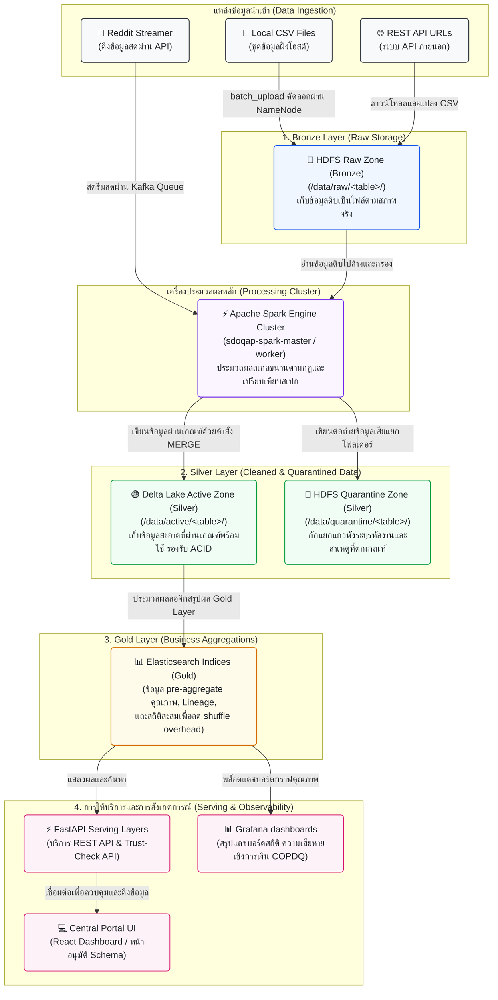
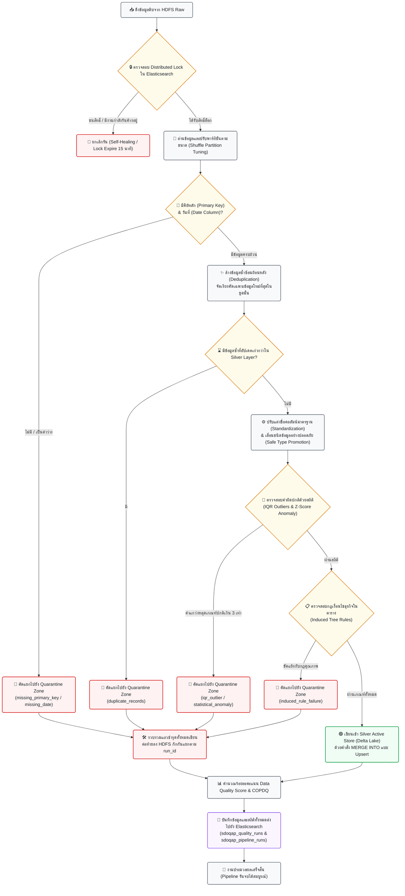

# เอกสารการออกแบบสถาปัตยกรรมระบบ (System Architecture Design)
## โครงการ SDOQAP (Scalable Data Observability and Quality Assurance Platform)

เอกสารนี้แสดงการออกแบบโครงสร้างสถาปัตยกรรมการทำงานเชิงลึกของระบบ SDOQAP ตั้งแต่ต้นน้ำจนถึงปลายน้ำ โดยครอบคลุมทั้งการคัดแยกข้อมูลคุณภาพ และระบบควบคุมธรรมาภิบาลโครงสร้างข้อมูลที่เปลี่ยนแปลง (Schema Drift Governance)

---

## 1. แผนภาพสถาปัตยกรรมภาพรวม (High-Level Architecture Diagram)
แผนภาพนี้แสดงโครงสร้างสถาปัตยกรรมข้อมูลแบบ **Medallion Architecture** โดยแบ่งโซนข้อมูลออกเป็น **Bronze, Silver, และ Gold Layers** เพื่อแสดงการไหลของข้อมูลตั้งแต่ต้นทางจนออกไปยังแผงควบคุมและช่องบริการข้อมูล



---

## 2. แผนภาพการคัดแยกข้อมูลระดับแถว (Data Segregation Flow)
แผนภาพนี้แสดงตรรกะหัวใจสำคัญของโครงการ (Data Segregation) โดยแสดงให้เห็นว่าเมื่อข้อมูลเข้าสู่ Spark แล้ว ข้อมูลที่ดีจะไหลไปที่ตารางสะอาด Active (Silver) อย่างไร และข้อมูลที่ชำรุดรายบรรทัดจะถูกคัดแยกแยกแยะส่งไป Quarantine Store โดยที่ระบบประมวลผลรวม (Pipeline) ไม่ล่มหยุดชะงัก



---

## 3. กลไกจัดการโครงสร้างเปลี่ยนรูป (Schema Drift Governance Flow)
แผนภาพนี้แสดงผังการตัดสินใจเมื่อพบคอลัมน์มีการเพิ่มขึ้น หายไป หรือเปลี่ยนชนิดข้อมูลอย่างไม่สอดคล้องกับไฟล์สเปก `schema_registry.json` เพื่อทำระบบควบคุมอนุมัติแบบกึ่งอัตโนมัติ (Schema Approval Gate)

```mermaid
graph TD
    classDef start fill:#f8f9fa,stroke:#4b5563,stroke-width:1.5px,color:#212529;
    classDef process fill:#e8f4fd,stroke:#1d78c1,stroke-width:1.5px,color:#212529;
    classDef decision fill:#fffbeb,stroke:#d97706,stroke-width:1.5px,color:#212529;
    classDef auto fill:#f0fdf4,stroke:#16a34a,stroke-width:2px,color:#212529;
    classDef block fill:#fef2f2,stroke:#dc2626,stroke-width:2px,color:#212529;
    classDef user fill:#faf5ff,stroke:#7c3aed,stroke-width:2px,color:#212529;

    Start["📥 Spark ตรวจสอบโครงสร้างข้อมูลนำเข้า"]:::start --> Compare{"🔍 เปรียบเทียบกับ Schema ดั้งเดิม<br>(schema_registry.json)"}:::process
    
    Compare --> CheckDrift{"⚠️ ตรวจพบ Schema Drift หรือไม่?"}:::decision
    
    CheckDrift -->| ไม่พบ | ContinueBatch["🟢 ประมวลผลข้อมูลต่อ เขียนลง HDFS Active"]:::auto
    
    CheckDrift -->| ตรวจพบ | CalcSeverity["📏 คำนวณคะแนนความรุนแรงของโครงสร้าง<br>(Severity Score = New*1 + Missing*5 + TypeMismatch*5)"]:::process
    
    CalcSeverity --> EvalGate{"🚦 ประเมินขีดเกณฑ์ผ่านสเปก (Evolution Gate)"}:::decision
    
    EvalGate -->| ปลอดภัย (พบคอลัมน์ใหม่เพิ่มเติมเท่านั้น Score <= 4) | AutoApprove["🟢 Auto-Evolve (อนุมัติผ่านสเปกอัตโนมัติ)<br>- อัปเดตสเปกบน Disk และ ES ทันที<br>- บันทึก Proposal สถานะ APPROVED ใน ES"]:::auto
    AutoApprove --> ContinueBatch
    
    EvalGate -->| อันตราย (คอลัมน์หายหรือชนิดข้อมูลเพี้ยน Score > 4) | BlockSpec["🔴 Block Spec (ระงับโครงสร้างแบบมีเกตควบคุม)<br>- แปลงคอลัมน์เป็น String เพื่อรักษาการรันภาพรวม<br>- ส่งข้อเสนอเป็นสถานะ PENDING ใน ES<br>- แจ้งเตือน Critical Alert ไป n8n เพื่อบอกวิศวกรข้อมูล"]:::block
    
    BlockSpec --> AlertNotify["📢 n8n ยิงสตรีมแจ้งเตือนไปยังทีม Data Engineer (Slack/Line/Teams)"]:::process
    
    AlertNotify --> DE_Intervene["👨‍💻 Data Engineer เข้าตรวจสอบรายละเอียดผ่าน Central Portal UI"]:::user
    
    DE_Intervene --> Decision{"ตัดสินใจอนุมัติโครงสร้างนี้หรือไม่?"}:::decision
    
    Decision -->| อนุมัติ (Approve via API) | Approved["🟢 บันทึกยืนยันโครงสร้างใหม่<br>- อัปเดตข้อมูลไฟล์สเปกบน Disk<br>- ปรับสถานะ Proposal ใน ES เป็น APPROVED"]:::auto
    Decision -->| ปฏิเสธ (Reject via API) | Rejected["🔴 บันทึกการปฏิเสธโครงสร้าง<br>- ปรับสถานะเป็น REJECTED<br>- ข้อมูลรอบถัดไปที่เพี้ยนจะเข้าโฟลเดอร์กักกัน"]:::block
    
    Approved --> NextRun["🔄 ข้อมูลที่ค้างอยู่จะถูกดึงเข้าประมวลผลต่อตามโครงสร้างใหม่ในรอบถัดไป"]:::process
```

---

## 4. แผนผังเทคโนโลยีและการควบคุมอัตโนมัติ (Technology Stack & Automation Map)

ระบบนี้รวมการทำงานเข้าด้วยกันเป็นสแต็กเทคโนโลยีที่มีการไหลและการสั่งการทำงานที่เป็นอัตโนมัติ (Automated Pipelines):

| บทบาทการทำงาน (System Role) | เทคโนโลยีหลัก (Tech Stack) | ลักษณะการควบคุมอัตโนมัติ (Automation Features) |
| :--- | :--- | :--- |
| **Ingestion Engine** (นำเข้าข้อมูล) | Python, PowerShell scripts, **Apache Kafka**, **Zookeeper** | ทริกเกอร์ตามคาบเวลา ดาวน์โหลด API ตรวจหา payload แปลง JSON และสตรีมสดเข้าคิวรับส่งทันที |
| **Data Lake Storage** (การเก็บข้อมูลหลัก) | **Apache Hadoop HDFS**, **Delta Lake** | จัดเก็บเลเยอร์แบบ Medallion โดยแยกสิทธิ์เขียนอัตโนมัติ ข้อมูลสะอาดเขียนผ่าน MERGE (Upsert) ป้องกันข้อมูลซ้ำ |
| **Compute Engine** (ตัวประมวลผลหลัก) | **Apache Spark** (Master-Worker Cluster) | ประมวลผลแบบกระจายศูนย์อัตโนมัติ ปรับ Shuffling อัตโนมัติตามขนาดข้อมูล คัดแยกแถวเสียลง Quarantine Zone แบบ Row-level |
| **Observability DB** (ระบบตรวจสอบ) | **Elasticsearch**, **Kibana** | ดักจับสถานะ จัดการ distributed locks อัตโนมัติ ปลดปล่อยสิทธิ์การล็อกแบบเซฟตี้ เก็บดัชนีคุณภาพและ Lineage |
| **Serving Layer** (ส่วนคุมและให้บริการ) | **FastAPI**, **Nginx** | บริหารจัดการการเข้าถึง API, บริการฟังก์ชัน **Trust-Check** สำหรับดึงข้อมูลปลายทาง และเป็นตัวกลางอนุมัติ Schema Drift |
| **UI Portal & Monitoring** (หน้าแผงคุม) | **React.js (Central Portal)**, **Grafana** | แสดงสถิติและ Lineage อัตโนมัติ วาดกราฟเปรียบเทียบคุณภาพและแสดงค่า COPDQ (มูลค่าความสูญเสียจากข้อมูลชำรุด) |
| **Workflow Automation** (ท่อควบคุมภายนอก) | **n8n** | ตรวจสอบดัชนีใน ES คอยแจ้งเตือนภัยผ่านช่องแชทแบบเรียลไทม์ และประสานงานส่งต่อ API ทันทีเมื่อเกิด Schema Drift |
