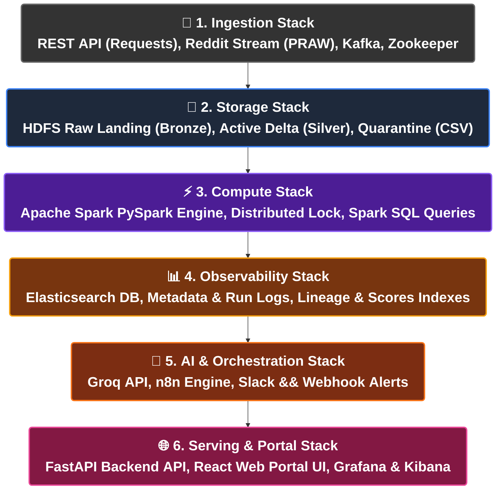

# แผนผังเทคโนโลยี (Technology Stack Map)
## โครงการ SDOQAP (Scalable Data Observability and Quality Assurance Platform)

เอกสารนี้รวบรวมแผนผังย่อยสำหรับ **สไลด์นำเสนอแผ่นที่ 4: แผนผังเทคโนโลยี (Technology Stack Map)** โดยเฉพาะ เพื่อแสดงเครื่องมือ เฟรมเวิร์ก และเทคโนโลยีทั้งหมดที่ใช้ในการพัฒนาระบบแบ่งตามสเปกสถาปัตยกรรม 6 เลเยอร์หลัก โดยปรับปรุงลดขนาดตัวอักษรลงมาให้อยู่ในเกณฑ์สมดุลและสวยงามขึ้นเป็นขนาด **26px ตัวหนา** เพื่อไม่ให้ตัวอักษรดูหนาเตอะจนเกินไป และล็อกขอบกล่องไม่ให้หักคำตัดขึ้นบรรทัดใหม่

---

## 1. แผนผังเทคโนโลยีสำหรับสไลด์แผ่นที่ 4 (Slide 4 Mermaid Flowchart)

---

## 2. รายละเอียดเทคโนโลยีตามชั้นเลเยอร์ (Technology Layer Breakdown)

1. **Ingestion Layer (การนำเข้าข้อมูล):**
   * **REST APIs / Python Requests:** ดึงข้อมูลดิบในรูปแบบ JSON จาก REST API ปลายทาง
   * **Python PRAW (Reddit API wrapper):** เชื่อมต่อดึงคอมเมนต์และความคิดเห็นแบบสตรีมสด
   * **Apache Kafka & Zookeeper:** ทำหน้าที่เป็น Message Queue ในการคัดกรองข้อมูลสตรีมมิ่งมวลใหญ่ก่อนส่งต่อไปประมวลผล
2. **Storage Layer (การจัดเก็บข้อมูล):**
   * **HDFS (Hadoop Distributed File System):** คลังจัดเก็บข้อมูลระดับดิบ (Bronze Layer) และระดับเขตกักกันข้อมูลชำรุด (Quarantine Store)
   * **Delta Lake / Parquet:** โครงสร้างการจัดเก็บข้อมูลสะอาดระดับประยุกต์ใช้งาน (Silver Active Store) เพื่อรับประกันธุรกรรม ACID
3. **Compute Layer (การประมวลผล):**
   * **Apache Spark / PySpark:** ประมวลผลข้อมูลคู่ขนานแบบกระจายศูนย์ในหน่วยความจำดิบ (In-Memory Processing) สำหรับคำนวณสถิติและคัดแยกข้อมูลคุณภาพ
   * **Distributed Lock Manager:** จัดการการล็อกตารางขนาน (Optimistic Concurrency Control) ป้องกันการเกิด Race Condition
4. **Observability Layer (การสังเกตการณ์):**
   * **Elasticsearch DB:** จัดทำดัชนีเก็บประวัติการรัน คะแนนตัวชี้วัดคุณภาพข้อมูล (Data Quality Scores) เส้นทางการไหลของข้อมูล (Lineage) และตั๋วงานวิเคราะห์ Drift
5. **AI & Orchestration Layer (ปัญญาประดิษฐ์และเวิร์กโฟลว์):**
   * **Groq API:** ปัญญาประดิษฐ์ประมวลผลเชิงความหมาย วิเคราะห์สาเหตุข้อบกพร่อง และสร้างกฎ Dynamic Rules
   * **n8n Automation Engine:** รันระบบทริกเกอร์แจ้งเตือนตั๋วปัญหาอัตโนมัติไปยัง Slack, Email หรือ Microsoft Teams
6. **Serving & Presentation Layer (การให้บริการข้อมูล):**
   * **FastAPI Backend (Python):** บริการ REST APIs สำหรับแดชบอร์ดและเปิดรับปิดลูปคอนฟิก
   * **React Web Portal:** แผงควบคุมระบบสำหรับเรียกดูข้อมูลและกดยอมรับกฎ Dynamic Rules
   * **Grafana & Kibana:** แสดงผลกราฟแนวโน้ม และเครื่องมือเสิร์ชค้นหา Log ความผิดพลาดในท่อประมวลผล
