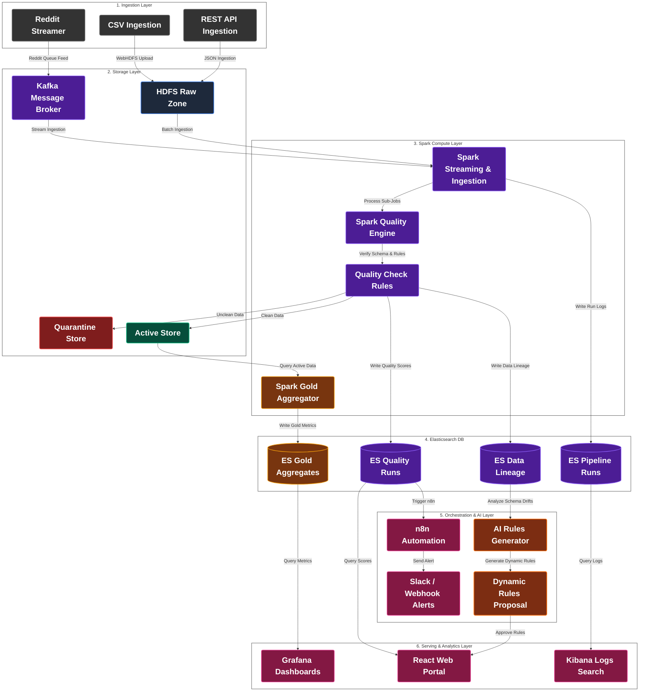

# เอกสารการออกแบบสถาปัตยกรรมระดับองค์กรแบบบูรณาการ (Enterprise-Grade Unified System Architecture)
## โครงการ SDOQAP (Scalable Data Observability and Quality Assurance Platform)

เอกสารนี้รวบรวมแผนผังการไหลของข้อมูลและขั้นตอนการทำงานทั้งหมดของระบบ SDOQAP ไว้อย่างครบถ้วนในหนึ่งภาพ โดยปรับโครงสร้างเล่าเรื่องจากพิมพ์เขียวตัวอย่างมาจัดวางด้วยคำอธิบายรูปแบบ **คำหลักเชิงเทคนิค (Keywords)** แทนประโยคยาว ๆ และบังคับขนาดฟอนต์ของกล่องโหนดให้มีขนาดใหญ่พิเศษยักษ์ (**font-size: 28px, ตัวหนา**) เพื่อให้อ่านง่าย ชัดเจน และนำไปจัดวางในสไลด์นำเสนอผลงาน (Slide Presentation 16:9) ได้อย่างสวยงามสะดุดตาที่สุดโดยไม่มีพื้นหลังและไม่ปนเปด้วยคำบรรยายที่รกตัวแผนผัง

---

## 1. แผนภาพสถาปัตยกรรมแบบคีย์เวิร์ดนำเสนอสไลด์ (Keyword-Based Slide Diagram)

---

## 2. รายละเอียดการทำงานของระบบประมวลผลข้อมูลและควบคุมคุณภาพอัตโนมัติ SDOQAP
### ปรัชญาการออกแบบ: แก้ปัญหาเชิงวิศวกรรมที่ต้นเหตุ (Upstream-First Remediation)

ระบบ SDOQAP ยึดหลักการทำงานแบบ **"Root Cause Focus"** โดยปฏิเสธแนวทางการจัดการปัญหาข้อมูลเสียหายเพียงแค่ที่ปลายทาง การคัดแยกข้อมูลที่เสียหายออกไปเก็บไว้ในเขตกักกัน (Quarantine Zone) เป็นเพียงมาตรการชั่วคราวเพื่อปกป้องระบบหลักไม่ให้แครช (Resilience) เท่านั้น 

เป้าหมายสูงสุดคือ การใช้ระบบตรวจจับและปัญญาประดิษฐ์วิเคราะห์ย้อนกลับไปหาแหล่งกำเนิด (Upstream Source) เพื่อหาสาเหตุที่แท้จริง และส่งข้อมูลป้อนกลับเพื่ออัปเดตหรือแจ้งเตือนการแก้ไขที่ระบบต้นทางโดยตรง เพื่อไม่ให้ปัญหาข้อมูลชำรุดแบบเดิมเกิดขึ้นซ้ำอีกในรอบถัดไป

---

### 2.1 ขั้นตอนการทำงานโดยละเอียด (End-to-End System Workflow)

#### เลเยอร์ที่ 1: การนำเข้าข้อมูลดิบและแปลงสิทธิ์ (Automated Ingestion Layer)
1. **การทริกเกอร์แหล่งข้อมูล:** ระบบรองรับการนำเข้าข้อมูล 4 รูปแบบหลัก:
   * **Local CSV Files:** ข้อมูลแบบไฟล์วางบนไดเรกทอรีของโฮสต์
   * **REST API URLs:** ข้อมูล JSON ดึงจาก URL ภายนอกผ่าน HTTP Get Request
   * **Reddit Streamer:** ข้อมูลฟีดเนื้อหาและความคิดเห็นสดผ่าน Reddit API
   * **PostgreSQL OLTP Database:** ข้อมูลธุรกรรมแบบฐานข้อมูลจำลอง (สำหรับการทดสอบสเกล)
2. **การแปลงสภาพข้อมูล JSON (PowerShell Conversion Gate):** สำหรับกรณี API หรือ Reddit ฟีดที่เป็น JSON สคริปต์ `test_data_source.bat` จะสั่งงานสคริปต์ PowerShell ตรวจสอบโครงสร้างคีย์อาร์เรย์ หากพบรูปแบบ JSON จะทำการแปลงสภาพให้เป็นแฟ้มตาราง CSV ทันทีเพื่อเตรียมส่งขึ้น HDFS
3. **การส่งขึ้นพื้นที่ข้อมูลดิบ (Bronze Layer):** คัดลอกไฟล์ขึ้นระบบเก็บไฟล์ HDFS ที่พาธ `/data/raw/<table_name>/` เพื่อเก็บเป็นประวัติข้อมูลดิบถาวร (Immutable History)
4. **การปรับสิทธิ์ความปลอดภัย (Access Control Policy):** เพื่อป้องกันสิทธิ์ไฟล์ชนกันระหว่างระบบ Host และระบบ Spark ใน Container ระบบจะทริกเกอร์ชุดคำสั่ง `hdfs dfs -chmod -R 777 /data` และ `hdfs dfs -chown -R spark:spark /data` บน HDFS NameNode อัตโนมัติ

#### เลเยอร์ที่ 2: กลไกย่อยควบคุมการทำงานของ Spark (Spark In-Memory Execution Micro-ops)
เมื่อมีการทริกเกอร์สั่งงาน Spark Batch Job หรือ Spark Streaming จากคิว Kafka ตัวโฮสต์จะเริ่มสั่งงาน Spark Master โยงไปยัง Workers เพื่อดึงข้อมูลดิบจาก Bronze Layer มาประมวลผล โดยทำงานตามลำดับขั้นตอนย่อยในแรมดังนี้:

1. **ระบบ distributed locks & OCC self-healing:**
   * Spark ตรวจสอบสิทธิ์ว่าตารางข้อมูลดังกล่าวมีการรันงานอื่นซ้ำซ้อนอยู่หรือไม่ โดยส่งคำขอ HTTP PUT ไปจองล็อกที่ Elasticsearch บนดัชนี `/sdoqap_run_locks/_doc/<table_name>?op_type=create`
   * หากมีงานอื่นจองค้างอยู่และประมวลผลยังไม่เสร็จ (ชนสิทธิ์ล็อก) ระบบจะดึงข้อมูลวันหมดอายุ (`expires_at` ของล็อกมีอายุ 15 นาที) 
   * หากหมดเวลาแล้วและเป็นล็อกค้างเนื่องจากระบบรอบก่อนแครช Spark จะทำ **Optimistic Concurrency Control (OCC)** เขียนทับเพื่อทำลายล็อกค้างเดิมและจองล็อกใหม่ทันทีโดยเปรียบเทียบเลข `_seq_no` และ `_primary_term` แบบอะตอม
   * หากล็อกยังไม่หมดอายุและชนกันจริง ระบบจะจบการรัน (Cancel Run) และส่ง Log สถานะขัดแย้งไปยัง Elasticsearch เพื่อรอวิศวกรตรวจสอบ
2. **การปรับ Shuffle Partition ตามขนาดข้อมูลดิบ (Size-Based Shuffle Tuning):**
   * Spark จะเรียกใช้ Hadoop FileSystem API ตรวจวัดความจุโฟลเดอร์ดิบ หากขนาดโฟลเดอร์ **ต่ำกว่า 50 MB** (ข้อมูลชุดขนาดเล็ก) Spark จะลดจำนวนพาร์ทิชันย่อย (`spark.sql.shuffle.partitions`) เหลือ **2** เพื่อไม่ให้เกิด Overhead ในการ Shuffle ย้ายข้อมูลข้ามเครื่อง 
   * หากขนาดข้อมูลดิบ **มากกว่าหรือเท่ากับ 50 MB** Spark จะปรับจำนวนพาร์ทิชันย่อยเพิ่มขึ้นเป็น **10+** พาร์ทิชัน เพื่อกระจายการทำงานลงเครื่อง Worker ทั้งหมด
3. **การแปลงชื่อคอลัมน์มาตรฐาน (Column Standardization):**
   * รันฟังก์ชันล้างชื่อหัวคอลัมน์ แปลงเป็นตัวพิมพ์เล็กทั้งหมด และใช้คำสั่ง Regex ลบอักขระพิเศษเพื่อป้องกันการแมตช์สเปกโครงสร้างข้อมูล (Schema Mapping) ผิดพลาด
4. **การเลื่อนระดับสเปกข้อมูลอย่างปลอดภัย (Safe Type Promotion):**
   * คอลัมน์ที่จดทะเบียนไว้ในโครงสร้างระบบว่าเป็นจำนวนเต็ม (`IntegerType`) แต่อาจมีข้อมูลดิบที่มีเลขทศนิยมปะปนเข้ามา Spark จะสแกนคอลัมน์ตัวเลขเหล่านั้น หากมีข้อมูลประเภททศนิยมแม้แต่แถวเดียว จะทำการยกระดับคอลัมน์ในแรมให้เป็น `DoubleType` อัตโนมัติ เพื่อประคองระบบไม่ให้ประมวลผลผิดพลาดเกิดค่า NULL
5. **การดักจับ Schema Drift (Evolution Gate):**
   * นำรายการคอลัมน์ของข้อมูลปัจจุบันมาเปรียบเทียบกับสเปกจดทะเบียนใน `schema_registry.json` เพื่อคำนวณระดับความอันตราย (Severity Score)
   * $\text{Severity Score} = (\text{จำนวนคอลัมน์ใหม่} \times 1) + (\text{จำนวนคอลัมน์ที่ขาดหาย} \times 5) + (\text{ชนิดข้อมูลไม่ตรงกัน} \times 5)$
   * **กรณี Safe Schema Drift (Score <= 4):** เกิดจากมีคอลัมน์ใหม่เพิ่มเข้ามาอย่างเดียว โดยไม่มีคอลัมน์เก่าหายไป ระบบจะยอมรับการเปลี่ยนแปลงอัตโนมัติ (Auto-Evolve) และบันทึกคอลัมน์ใหม่ลงใน Registry
   * **กรณี Dangerous Schema Drift (Score > 4):** เกิดจากมีคอลัมน์เดิมหายไปหรือชนิดข้อมูลขัดแย้งกันอย่างรุนแรง ระบบจะระงับการจดทะเบียนสเปกใหม่ และแปลงชนิดข้อมูลคอลัมน์ที่เป็นปัญหาเหล่านั้นเป็นข้อความทั่วไป (`StringType`) เพื่อป้องกันข้อมูลสูญหาย จากนั้นส่งตั๋วข้อเสนอปรับแก้เข้าสู่ Elasticsearch ในสถานะ PENDING เพื่อรอมนุษย์พิจารณา

#### เลเยอร์ที่ 3: ระบบคัดแยกและตรวจสอบคุณภาพ 3 ชั้น (3-Layer Quality Engine)
ข้อมูลหลังจากไหลผ่านด่าน Evolution Gate จะถูกนำมาประเมินคุณภาพในระดับแถว (Row-level) โดยแบ่งกฎออกเป็น 3 เลเยอร์:

1. **Layer 1: Static Rules (กฎเงื่อนไขพื้นฐาน):**
   * ตรวจสอบความถูกต้องทางโครงสร้างพื้นฐานโดยอ้างอิงจากไฟล์ `rules_config.json` เช่น ห้ามฟิลด์คีย์หลัก (Primary Key) เป็นค่าว่าง (Null), ตรวจสอบสเปกรูปแบบฟิลด์วันที่ และชนิดข้อมูล
2. **Layer 2: Statistical Dynamic Rules (กฎเชิงสถิติและความแปรปรวน):**
   * ดึงข้อมูลสะสมในระบบเพื่อหาความผิดปกติของตัวเลขเชิงลึกผ่านสคริปต์ `dynamic_rules_engine.py` โดยประเมิน 2 ส่วน:
     * **IQR Outlier Detection:** คำนวณช่วงปกติทางสถิติ $[Q_1 - (1.5 \times IQR), Q_3 + (1.5 \times IQR)]$ แถวข้อมูลที่มีค่าหลุดพ้นขอบเขตนี้จะถูกปัดตกเกณฑ์
     * **Z-Score Anomaly Detection:** คำนวณความเบี่ยงเบนของตัวเลข หากพบแถวใดมีค่า $|Z| > 3.0$ จะจัดว่าเป็นค่าที่ผิดปกติอย่างมีนัยสำคัญ
3. **การล้างแถวข้อมูลซ้ำระดับแถว (Deduplication Logic):**
   * ข้อมูลแถวเดียวกันที่ถูกส่งมาอัปเดตหลายรอบจะถูกคัดเลือกเฉพาะแถวล่าสุด (อ้างอิงตามคอลัมน์วันที่อัปเดต Date DESC) โดยระบบจะดึงแถวที่ล้าสมัยออกไปเก็บไว้ใน Quarantine Zone ผ่านกลไกการจับคู่วิเคราะห์ย้อนกลับ (Anti-Join)

#### เลเยอร์ที่ 4: การคัดแยกและจัดเก็บข้อมูล Silver Layer (Active vs Quarantine)
ผลการประเมินแถวข้อมูลจากเลเยอร์ 3 จะถูกนำมาแยกจัดเก็บเป็น 2 เส้นทาง (Data Segregation Routing):
* **HDFS Active Zone (Silver Layer - Delta Lake):**
  * สำหรับแถวข้อมูลที่ผ่านเกณฑ์คุณภาพครบถ้วน ระบบจะบันทึกข้อมูลเข้า Silver Layer ปลายทางในรูปแบบ **Delta Lake Format** โดยใช้คำสั่ง **Delta Lake MERGE INTO** (Upsert) เพื่อแก้ไขและเพิ่มแถวข้อมูลแบบมีธุรกรรมที่ปลอดภัยระดับธุรกรรม ACID
* **HDFS Quarantine Zone (Silver Layer - CSV):**
  * สำหรับแถวที่ตกเกณฑ์คุณภาพ (เช่น ค่าว่าง, ซ้ำซ้อน, หลุดช่วงสถิติ IQR) ระบบจะแยกเขียนไฟล์ต่อท้าย (Append) ในโฟลเดอร์แยกต่างหากตามประเภทสาเหตุ (`reject_reason` เช่น `iqr_outlier`, `duplicate_records`, `null_primary_key`) เพื่อไม่ให้ท่อส่งข้อมูลหลักหยุดทำงานและล่ม

#### เลเยอร์ที่ 5: คลังจัดเก็บข้อมูลเชิงสังเกตการณ์ (Observability Data Store)
ระบบจะรวบรวมตัวชี้วัดคุณภาพข้อมูล (Data Quality Metrics) และสถิติทั้งหมดในขณะรันส่งบันทึกขึ้นระบบค้นหา Elasticsearch:
* **ดัชนี sdoqap_quality_runs (ES Logs):** จัดเก็บประวัติเวลาประมวลผล ยอดสัดส่วนข้อมูลที่ผ่านเกณฑ์ และมูลค่าเสียหายสะสมจากข้อมูลชำรุด (Cost of Poor Data Quality - COPDQ)
* **ดัชนี sdoqap_ai_rule_proposals (ES Proposals):** จัดเก็บข้อเสนอแนะแก้ไขกฎสเปกและตั๋ว Remediation Ticket ที่ออกโดย AI
* **ดัชนี sdoqap_settings (ES Settings):** จัดเก็บค่าคอนฟิกต่าง ๆ ของระบบและ Groq API Key

#### เลเยอร์ที่ 6: ปัญญาประดิษฐ์ผู้วิเคราะห์และสร้างกฎเกณฑ์พลวัต (AI Dynamic Rules Generator - Layer 3)
ลอจิกการทำงานของปัญญาประดิษฐ์เพื่อทำหน้าที่ปรับแต่งกฎและสเปกข้อมูลอย่างยืดหยุ่น:
1. **การวิเคราะห์ข้อมูลและ Schema ที่เพิ่มเข้ามาใหม่ (AI Rules Adaptation):**
   * AI Advisor จะตรวจสอบวิวัฒนาการของข้อมูล (Data Evolution) จากดัชนี `sdoqap_lineage_runs` 
   * เมื่อพฤติกรรมข้อมูลเปลี่ยนไปหรือมีฟิลด์ข้อมูลใหม่ ๆ เพิ่มเข้ามา ปัญญาประดิษฐ์จะทำการวิเคราะห์หาสหสัมพันธ์เชิงความหมาย (Semantic Analysis) และคำนวณช่วงสถิติใหม่ที่สอดคล้องกับพฤติกรรมข้อมูลปัจจุบัน
2. **การสร้างกฎเกณฑ์ Dynamic Rules อัตโนมัติ:**
   * AI จะไม่สร้างเพียง Remediation Ticket สำหรับแจ้งแก้ต้นทางเท่านั้น แต่จะทำหน้าที่ **"สร้างและปรับแต่งกฎคุณภาพข้อมูลพลวัต (Dynamic Rules Proposal)"** สำหรับตรวจสอบข้อมูลนั้น ๆ โดยเฉพาะ เพื่อส่งมอบไปแสดงผลที่แผง React Portal
   * เมื่อ Data Engineer กดปุ่ม 'อนุมัติ' (Approve) กฎ Dynamic Rules เหล่านี้จะถูกส่งไปบันทึกเพิ่มลงดิสก์ทันที เพื่อนำไปโหลดประเมินใน Spark Job รอบถัดไป ทำให้ระบบสามารถ **"ประเมินและคัดแยกข้อมูลใหม่ได้อย่างราบรื่นโดยไม่แครช"**

#### เลเยอร์ที่ 7: วงจรปิดป้อนกฎกลับลงระบบเก็บไฟล์ (Closed-Loop Feedback Loop)
นี่คือจุดสิ้นสุดของวงจรปิดการปรับแต่งสเปกเพื่อป้องกัน Pipeline ล่ม:

1. **หน้าจอการอนุมัติกฎ (React UI ➔ FastAPI):**
   * วิศวกรข้อมูลทบทวนตั๋วข้อเสนอแนะของ AI บนหน้าจอ Portal หากยืนมยันว่ากฎใหม่ปลอดภัยและสอดคล้องกับสภาพธุรกิจจริง จะกดยืนยันอนุมัติ (Approve Proposal)
2. **การอัปเดตกฎกลับลงแผ่นดิสก์ (FastAPI ➔ Disk Write):**
   * Backend ของ FastAPI จะแปลงคำแนะนำที่อนุมัติแล้ว และทำการเขียนแก้ไขข้อมูลลงไฟล์โดยตรง:
     * เขียนอัปเดตเกณฑ์ข้อห้ามใหม่ใน **`rules_config.json`**
     * เขียนจดทะเบียนคอลัมน์เวอร์ชันใหม่ in **`schema_registry.json`**
3. **ผลลัพธ์รอบการทำงานถัดไป (Disk ➔ Spark Ingestion):**
   * ในการประมวลผลรอบถัดไป Spark Master จะดึงไฟล์คอนฟิกทั้งสองฉบับที่ได้รับการปรับเปลี่ยนเรียบร้อยแล้วบนดิสก์ขึ้นมาทำงาน ทำให้ข้อมูลรูปแบบใหม่ดังกล่าวสามารถตรวจสอบผ่านเกณฑ์ และบันทึกเข้าสู่พื้นที่ HDFS Active Zone (Silver Layer) ได้อย่างสมบูรณ์แบบอัตโนมัติ 

---

### 2.2 ระบบแจ้งเตือนและบริการข้อมูลปลายน้ำ (Downstream Serving & Alerts)

* **n8n Automation Engine:** คอยดึงข้อมูลตั๋วปัญหาที่ออกโดย AI ในดัชนี Elasticsearch เพื่อส่งการแจ้งเตือนระดับวิกฤตผ่าน Slack หรือ Microsoft Teams ไปหาผู้รับผิดชอบหรือผู้ดูแลระบบต้นทาง (Upstream Partners) โดยตรงแบบเรียลไทม์เพื่อแจ้งให้ปิดช่องโหว่ความผิดพลาด
* **Grafana Dashboards:** ดึงสถิติยอด COPDQ และสถิติตัวชี้วัดคุณภาพข้อมูลไปพล็อตกราฟเปรียบเทียบในแงุมธุรกิจสำหรับ Data Analyst และทีมบริหาร
* **Trust-Check API Service:** บริการปลายทาง `/api/v1/lineage/{table}/trust-check` บน FastAPI เพื่อให้บริการกับระบบภายนอก (เช่น โมเดล AI เครื่องอื่น หรือระบบ BI ปลายน้ำ) เข้ามาเช็คประวัติและระดับความน่าเชื่อถือของตารางข้อมูลในคลังก่อนที่จะดึงไปวิเคราะห์ เพื่อให้มั่นใจว่าข้อมูลมีความปลอดภัยพร้อมใช้งาน
